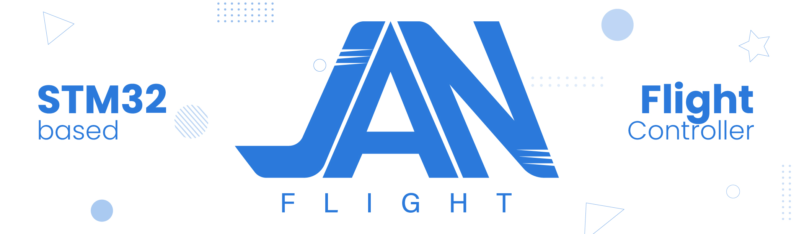

  

  
  

JanFlight is a toolkit for building DIY flight controllers using STM32, ESP32, or Raspberry Pi Pico boards. Flight tested Arduino-based code along with documentation is also provided to support rapid prototyping and development.

This is for hobbyists, tinkerers, DIY enthusiasts and ofcourse, non-coders too. There's also a theoretical [guide](https://janflight.in/#/content/basics) covering the fundamentals of drones, explained with block diagrams for absolute beginners. Everything is kept as simple and approachable as possible. That said, don't just blindly copy-paste, I encourage you to ask why things are done in a certain way, to understand low level working. 

The goal is anyone should be able to build a working flight controller for under $10, using off the shelf development boards and sensor breakout boards and learn the basics.

If you like JanFlight, please give it a ☆ star on [GitHub](https://github.com/oyegunmen/JanFlight).

## Hardware Requirements
* **Breakout Board:** STM32/ESP32/RP2350
* **IMU Sensor:** MPU6500

and other drone related parts.

| MCU Family | Breakout Board | Clock | Flash | RAM | Price |
|-------------|-----------------|-----------------|-----------------|-----------------|-----------------|
| **RP2350** | [Raspberry Pi Pico 2](https://www.raspberrypi.com/documentation/microcontrollers/pico-series.html#pico2) | 150MHz (overclock 300MHz) | 4MB | 520KB | ₹540/$6/€6 |
| **ESP32** | [ESP32 DevKitC](https://docs.espressif.com/projects/esp-dev-kits/en/latest/esp32/esp32-devkitc/user_guide.html) | 240MHz | 4MB | 520KB | ₹450/$5/€5 |
| **STM32** | [WeAct Studio STM32F405RGT6](https://github.com/WeActStudio/WeActStudio.STM32F4_64Pin_CoreBoard) | 168MHz | 1MB | 128KB | ₹1000/$7/€7 |

> [!NOTE]
> Firmware is tested on the above boards, but should support the broader STM32, ESP32, and Raspberry Pi microcontroller families. Configure the code to match your specific board's datasheet.

## Software Requirements
JanFlight is compiled and flashed using the Arduino IDE. Detailed steps are included in the JanFlight documentation website.

## Testing
The code is tested on following builds.
- [x] QuadCopter (Publishing video soon)
- [x] Plane

## License
This project is open-source and distributed under the [GPL-3.0 License](https://github.com/oyegunmen/JanFlight?tab=GPL-3.0-1-ov-file#readme).

## Disclaimer
This code is a shared, open source flight controller for small micro aerial vehicles and is intended to be modified to suit your needs. It is NOT intended to be used on manned vehicles. I do not claim any responsibility for any damage or injury that may be inflicted as a result of the use of this code. Use and modify at your own risk. More specifically put:

> [!WARNING]
> THIS SOFTWARE IS PROVIDED BY THE CONTRIBUTORS "AS IS" AND ANY EXPRESS OR IMPLIED WARRANTIES, INCLUDING, BUT NOT LIMITED TO, THE IMPLIED WARRANTIES OF MERCHANTABILITY AND FITNESS FOR A PARTICULAR PURPOSE ARE DISCLAIMED. IN NO EVENT SHALL THE CONTRIBUTORS BE LIABLE FOR ANY DIRECT, INDIRECT, INCIDENTAL, SPECIAL, EXEMPLARY, OR CONSEQUENTIAL DAMAGES (INCLUDING, BUT NOT LIMITED TO, PROCUREMENT OF SUBSTITUTE GOODS OR SERVICES; LOSS OF USE, DATA, OR PROFITS; OR BUSINESS INTERRUPTION) HOWEVER CAUSED AND ON ANY THEORY OF LIABILITY, WHETHER IN CONTRACT, STRICT LIABILITY, OR TORT (INCLUDING NEGLIGENCE OR OTHERWISE) ARISING IN ANY WAY OUT OF THE USE OF THIS SOFTWARE, EVEN IF ADVISED OF THE POSSIBILITY OF SUCH DAMAGE.