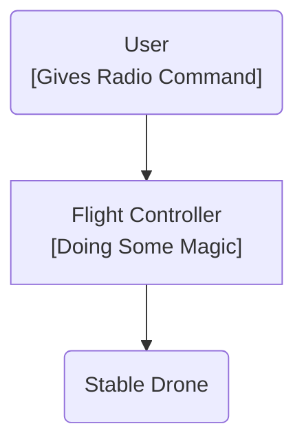

## Overview
JanFlight is arduino compatible **Flight Controller** for **STM32** Chip.

## Problem

Ever since I started tinkering around drones, my understanding of drone firmware was:

For hobbyists, the massiv codebases and complexity makes it incredibly difficult to learn the basics, make custom tweaks, or quickly prototype ideas.

## Why?
There exists production grade autopilots, then why [re-invent the wheel](https://programmerhumor.io/memes/reinventing-the-wheel)?

* To understand exactly what mathematical magic happens inside that silicon chip.
* It **looks cool** to fly a aircraft powered by your own flight controller.
* It's fun building your own flight controller.

## Example

The code is not yet tested on any working vehicle. Testing is planned for following standard configurations.

- [ ] QuadCopter (Test ongoing)
- [ ] Plane

## Safety

By default JanFlight has these safety features enabled:

* **Radio Failsafe**: Automatically shifts to predefined failsafe values, if the drone loses its radio signal or receives a glitched command.

* **Kill Switch**: A dedicated emergency switch that instantly cuts all power to the motors, overriding all other flight commands immediately.

## Disclamier

This code is a shared, open source flight controller for small micro aerial vehicles and is intended to be modified to suit your needs. It is NOT intended to be used on manned vehicles. I do not claim any responsibility for any damage or injury that may be inflicted as a result of the use of this code. Use and modify at your own risk.  

!> THIS SOFTWARE IS PROVIDED BY THE CONTRIBUTORS "AS IS" AND ANY EXPRESS OR IMPLIED WARRANTIES, INCLUDING, BUT NOT LIMITED TO, THE IMPLIED WARRANTIES OF MERCHANTABILITY AND FITNESS FOR A PARTICULAR PURPOSE ARE DISCLAIMED. IN NO EVENT SHALL THE CONTRIBUTORS BE LIABLE FOR ANY DIRECT, INDIRECT, INCIDENTAL, SPECIAL, EXEMPLARY, OR CONSEQUENTIAL DAMAGES (INCLUDING, BUT NOT LIMITED TO, PROCUREMENT OF SUBSTITUTE GOODS OR SERVICES; LOSS OF USE, DATA, OR PROFITS; OR BUSINESS INTERRUPTION) HOWEVER CAUSED AND ON ANY THEORY OF LIABILITY, WHETHER IN CONTRACT, STRICT LIABILITY, OR TORT (INCLUDING NEGLIGENCE OR OTHERWISE) ARISING IN ANY WAY OUT OF THE USE OF THIS SOFTWARE, EVEN IF ADVISED OF THE POSSIBILITY OF SUCH DAMAGE.

*Last Updated: 30th June 2026*