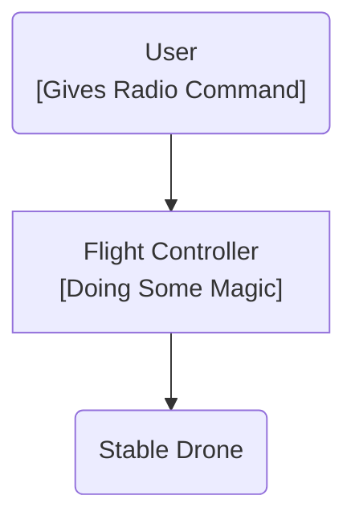

## Overview
JanFlight is a guide or toolkit to build DIY Flight Controller for any [High Performance](https://www.st.com/en/microcontrollers-microprocessors/stm32-32-bit-arm-cortex-mcus.html) STM32 MCU.

Highly readable, intutive and single file Arduino based Flight Stabilizer code is also provided to support rapid prototyping and development.

## Problem

Ever since I started tinkering around drones, my understanding of drone was:

If I just wanted to fly drones, off-the-shelf stuff would have been fine. But I wanted to build drones, make custom tweaks and test by weirdest ideas cheaply (In terms of time and money); which meant I needed to understand every single detail at hardware and software level.

The problem is, most mainstream autopilots are way too complex for a beginner to learn anything useful cheaply. I really needed something DIY that felt intuitive and approachable for a beginner.

## Why?

You could use [dRehmFlight](https://github.com/nickrehm/dRehmFlight), why [re-invent the wheel](https://programmerhumor.io/memes/reinventing-the-wheel)?

* To understand the physics and math at the hardware and software levels.
* I learn way more by building than by reading.
* Scarsity of teensy boards.
* To increase **cool factor** of my content creation ;)

btw square wheels are better in terms of comfort, so why not re-invent them? /s 

## Example

The code is not yet tested on any working vehicle. Testing is planned for following standard configurations.

- [ ] QuadCopter (The build is complete; PID Tuning ongoing)
- [ ] Plane

## Safety

By default JanFlight has these safety features enabled:

* **Radio Failsafe**: Automatically shifts to predefined failsafe values, if the drone loses its radio signal or receives a glitched command.

* **Kill Switch**: A dedicated emergency switch that instantly cuts all power to the motors, overriding all other flight commands immediately.

## Disclamier

This code is a shared, open source flight controller for small micro aerial vehicles and is intended to be modified to suit your needs. It is NOT intended to be used on manned vehicles. I do not claim any responsibility for any damage or injury that may be inflicted as a result of the use of this code. Use and modify at your own risk.  

!> THIS SOFTWARE IS PROVIDED BY THE CONTRIBUTORS "AS IS" AND ANY EXPRESS OR IMPLIED WARRANTIES, INCLUDING, BUT NOT LIMITED TO, THE IMPLIED WARRANTIES OF MERCHANTABILITY AND FITNESS FOR A PARTICULAR PURPOSE ARE DISCLAIMED. IN NO EVENT SHALL THE CONTRIBUTORS BE LIABLE FOR ANY DIRECT, INDIRECT, INCIDENTAL, SPECIAL, EXEMPLARY, OR CONSEQUENTIAL DAMAGES (INCLUDING, BUT NOT LIMITED TO, PROCUREMENT OF SUBSTITUTE GOODS OR SERVICES; LOSS OF USE, DATA, OR PROFITS; OR BUSINESS INTERRUPTION) HOWEVER CAUSED AND ON ANY THEORY OF LIABILITY, WHETHER IN CONTRACT, STRICT LIABILITY, OR TORT (INCLUDING NEGLIGENCE OR OTHERWISE) ARISING IN ANY WAY OUT OF THE USE OF THIS SOFTWARE, EVEN IF ADVISED OF THE POSSIBILITY OF SUCH DAMAGE.

*Last Updated: 4th July 2026*