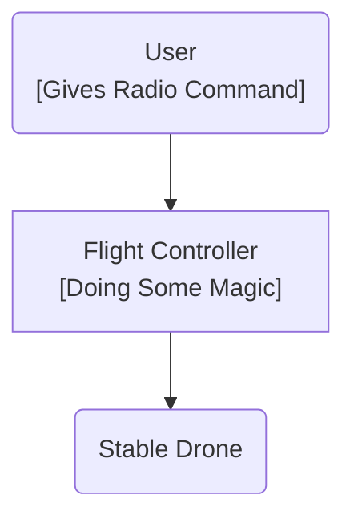

JanFlight is a toolkit for building DIY flight controllers using STM32, ESP32, or Raspberry Pi Pico boards. Flight tested Arduino-based code along with documentation is also provided to support rapid prototyping and development.

This is for hobbyists, tinkerers, DIY enthusiasts and ofcourse, non-coders too. Everything is kept as simple and approachable as possible. That said, don't just blindly copy-paste, I encourage you to ask why things are done in a certain way, to understand low level working. 

The goal is anyone should be able to build a working flight controller for under $10, using off the shelf development boards and sensor breakout boards and learn the basics.

If you like JanFlight, please give it a ☆ star on [GitHub](https://github.com/oyegunmen/JanFlight).

## Problem

Ever since I started tinkering around drones, my understanding of drone was:

```mermaid
flowchart TD
    Code["`Flight Controller
    [Doing Some Magic]`"]
    User("`User
    [Gives Radio Command]`")
    User --> Code
    Code --> D(Stable Drone)
```

If I just wanted to fly drones, off-the-shelf hardware/software would have been fine. But I wanted to build drones, while understanding that `magic`, to test my ideas cheaply (In terms of time and money).

Trying to learn drone fundamentals from a fully mature autopilot is like learning to code by reading an enterprise framework. The sheer volume of nested files and system dependencies introduces decent learning curve and may feel daunting. This guide and codebase provide a readable, low-overhead platform to help you master the essentials first before transitioning to industry-standard software.

## Why?

You could use [dRehmFlight](https://github.com/nickrehm/dRehmFlight), why re-invent the wheel?

* To understand the physics and math at the hardware and software levels.
* Unavailability of teensy boards.
* To increase the **cool factor** of my content creation ;)

## Example

The code is tested on following builds.

- [x] [QuadCopter](https://janflight.in/#/content/quadcopter.md) (Publishing video soon)
- [x] Plane

## Disclamier

This code is a shared, open source flight controller for small micro aerial vehicles and is intended to be modified to suit your needs. It is NOT intended to be used on manned vehicles. I do not claim any responsibility for any damage or injury that may be inflicted as a result of the use of this code. Use and modify at your own risk.  

!> THIS SOFTWARE IS PROVIDED BY THE CONTRIBUTORS "AS IS" AND ANY EXPRESS OR IMPLIED WARRANTIES, INCLUDING, BUT NOT LIMITED TO, THE IMPLIED WARRANTIES OF MERCHANTABILITY AND FITNESS FOR A PARTICULAR PURPOSE ARE DISCLAIMED. IN NO EVENT SHALL THE CONTRIBUTORS BE LIABLE FOR ANY DIRECT, INDIRECT, INCIDENTAL, SPECIAL, EXEMPLARY, OR CONSEQUENTIAL DAMAGES (INCLUDING, BUT NOT LIMITED TO, PROCUREMENT OF SUBSTITUTE GOODS OR SERVICES; LOSS OF USE, DATA, OR PROFITS; OR BUSINESS INTERRUPTION) HOWEVER CAUSED AND ON ANY THEORY OF LIABILITY, WHETHER IN CONTRACT, STRICT LIABILITY, OR TORT (INCLUDING NEGLIGENCE OR OTHERWISE) ARISING IN ANY WAY OUT OF THE USE OF THIS SOFTWARE, EVEN IF ADVISED OF THE POSSIBILITY OF SUCH DAMAGE.

*Last Updated: 7th Aug 2026*