# Basic Guide

> Who is this for? Anyone who has heard the word "drone" and wants to understand how to build one from scratch. No prior knowledge is assumed. Every term is explained the first time it appears.

---

## Table of Contents

1. [How to Read This Guide](#how-to-read-this-guide)
2. [Glossary of Key Terms](#glossary-of-key-terms)
3. [How a Drone Works](#how-a-drone-works)
4. [Physics & Aerodynamics](#1-physics--aerodynamics)
5. [Motors, ESCs & Props](#2-motors-escs--props)
6. [Batteries](#3-batteries)
7. [Flight Controller & Frame](#4-flight-controller--frame)
8. [Radio Link & Communication](#5-radio-link--communication)
9. [Ground Control Stations](#6-ground-control-stations)
10. [Specialized Sensors & Payloads](#7-specialized-sensors--payloads)
11. [Build Workflow](#8-build-workflow)

---

## How to Read This Guide

We start with basic physics, then work through every hardware component in the order you would actually select it when building. Each section has:

- **What it is?** A plain explanation assuming you know nothing
- **Why it matters?** What goes wrong if you ignore this
- **How to choose?** Actionable decision tables and rules
- **Visual aids:** Diagrams and Flowcharts to comprehend the concept

> Read sections in order the first time. On future visits, use the Table of Contents to jump directly to what you need.

---

## Glossary of Key Terms

Before anything else, here is a quick-reference table. Terms are explained in full when they first appear in the guide, but this table is here whenever you need a refresher.

| Acronym | Full Name | Plain-English Meaning |
|---------|-----------|----------------------|
| **AUW** | All-Up Weight | The total weight of the drone at any moment in flight (frame + battery + payload + everything) |
| **AWG** | American Wire Gauge | A wire-thickness standard. **Lower number = thicker wire.** AWG 10 is thicker than AWG 18. |
| **BEC** | Battery Eliminator Circuit | A small voltage regulator that steps down the high battery voltage (e.g. 22V) to the safe 5V used by electronics |
| **CAN** | Controller Area Network | A highly reliable communication bus used to connect sensors and smart devices; resistant to electrical noise |
| **ESC** | Electronic Speed Controller | The device between the battery and the motor. It translates a "speed command" from the flight controller into actual motor rotation |
| **FC** | Flight Controller | The circuit board that is the brain of the drone. It reads sensors and adjusts motor speeds to keep the vehicle stable |
| **IMU** | Inertial Measurement Unit | A chip that combines a gyroscope (rotation) and accelerometer (tilt/movement) to know orientation in 3D space |
| **I2C** | Inter-Integrated Circuit | A two-wire communication protocol for connecting sensors at short distances |
| **KV** | Motor Velocity Constant | How many RPM a motor spins per 1 Volt applied (with no load). Higher KV = faster but less torque |
| **mAh** | Milliampere-hour | A measure of battery capacity, how much energy is stored. Like a fuel tank size |
| **MCU** | Microcontroller Unit | The main processor chip on the FC (e.g. STM32 H7). Think of it as the CPU |
| **PDB** | Power Distribution Board | Distributes high-current power from the battery to each ESC/motor individually |
| **Sag** | Voltage Sag | The temporary drop in battery voltage when motors demand a lot of current at once |
| **TWR** | Thrust-to-Weight Ratio | Total maximum thrust divided by total weight. A 2:1 TWR means the drone can produce twice its own weight in thrust |
| **UART** | Universal Async Receiver/Transmitter | A serial communication port on the FC used to connect GPS, telemetry radios, etc |
| **VTOL** | Vertical Take-Off and Landing | Any aircraft that can lift straight up, hover, and land straight down. Quadcopters are a common example |

---

## How a Drone Works

Before selecting a single component, it helps to see how everything connects. A drone is really just a closed-loop control system: the pilot gives a command → the brain processes it → the motors react.

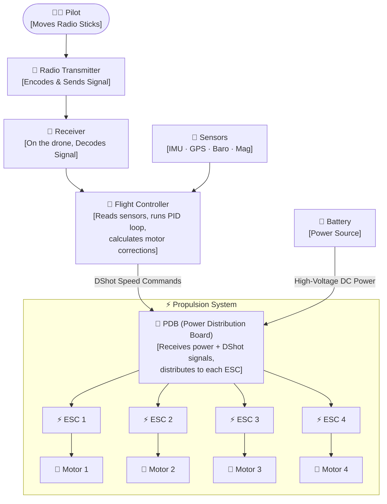

> **Reading the diagram:** The pilot's stick movements travel wirelessly to the drone's receiver, which forwards the intent to the Flight Controller. The FC consults its sensors to understand the drone's current orientation, then commands each of the four ESCs to adjust their motor's speed. This entire loop happens hundreds of times per second.

---

## 1. Physics & Aerodynamics

A drone stays in the air for exactly one reason: its motors push down on air hard enough to lift the entire weight of the drone up.

```
Lift (Thrust) ≥ Weight
```

If your motors cannot produce enough thrust to equal the weight, the drone cannot take off. If they can only just equal the weight, the drone hovers but has no ability to climb, maneuver, or resist wind. Practically that drone is Useless.

#### Thrust-to-Weight Ratio (TWR)

TWR is the single most important number you will calculate. It is simply:

```
TWR = Total Maximum Thrust ÷ Total Weight (AUW)
```

**The golden rule is a 2:1 TWR.** This means your motors together must produce **atleast twice** the drone's weight in thrust. At hover, the motors run at 50% output, leaving a full 50% in reserve for climbing, maneuvering, and fighting wind gusts.

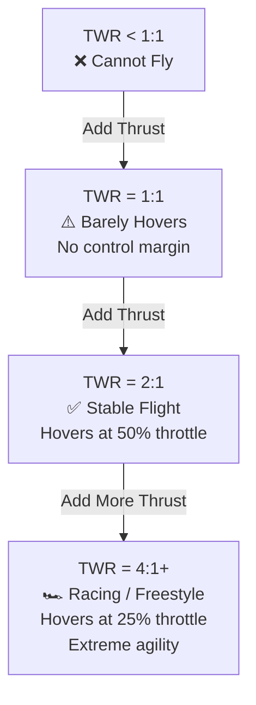

#### Disk Loading

Imagine two fans: a large slow ceiling fan and a small fast desk fan. Both can move the same **amount** of air, but the ceiling fan does it much more gently and uses far less electricity. Drones work the same way.

> Large propellers moving air slowly are more efficient than small propellers moving air fast. Always choose the largest propeller your frame physically allows.

The formal name for this is **Disk Loading**, the thrust per unit area of the propeller disk. Lower disk loading = more efficient = longer flight time.

---

## 2. Motors, ESCs & Props

The propulsion system has three parts that must be selected together: the **motor**, the **ESC**, and the **propeller**. Getting just one of these wrong can cause overheating, crashes, or poor performance.

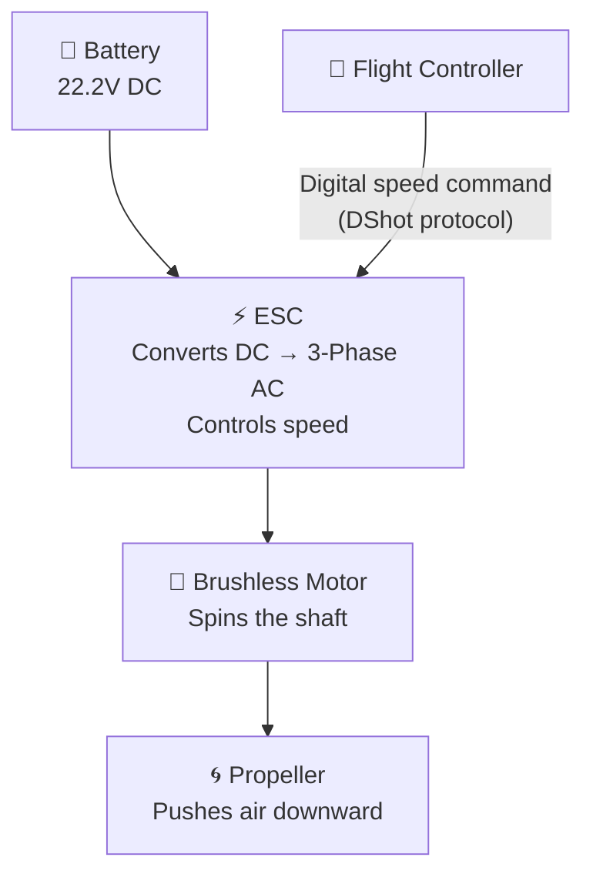

### 2.1 Propellers

#### What Is a Propeller?

A propeller is a rotating airfoil (like a spinning wing). As it rotates, it creates a pressure difference that pushes air downward, generating upward lift. Unlike airplane wings, a drone propeller generates lift by spinning rather than moving forward.

#### Reading Propeller Specifications

Propellers are labelled with two key numbers, e.g. **5045** or **5×4.5**:

```
[Diameter in inches] × [Pitch in inches] × [Number of blades]
Example: 5045-3 = 5" diameter, 4.5" pitch, 3 blades
```

- **Diameter:** The total tip-to-tip size. Larger diameter = more thrust at low RPM = more efficient for hovering.
- **Pitch:** Imagine the propeller as a screw. Pitch is how far forward one full rotation would theoretically push air. Higher pitch = more speed, more current draw, more heat.
- **Blade count:** More blades add thrust and reduce noise but also add drag and current draw. 2-blade props are efficient; 3-blade props are a balance; 4+ blades are for cinematic smoothness or specific applications.

#### Propeller Effect Cheat Sheet

| Change | Effect on Thrust | Effect on Efficiency | Effect on Speed | Best Use |
|--------|-----------------|---------------------|-----------------|---------|
| ↑ Diameter | ↑ More thrust | ↑ More efficient | ↓ Slower response | Endurance, heavy lifters |
| ↑ Pitch | → Same thrust | ↓ Less efficient | ↑ Faster top speed | Racing |
| ↑ Blade count | ↑ More thrust | ↓ Slightly less | ↓ Slower response | Cinematic, noise reduction |

#### Material

Most propellers are made from **polycarbonate plastic** (light and flexible, good for beginners since they bounce rather than shatter on crashes) or **carbon fiber** (stiffer, more efficient, and more expensive, but they shatter and the fragments are sharp and hazardous).

!> **Safety Note:** Carbon fiber propellers can cause serious injuries. Never hold a powered drone where spinning carbon props could contact you. Start with plastic props.

---

### 2.2 Motors

#### What Is a Brushless Motor?

Drone motors are **brushless DC motors**. Unlike the simple brushed motors in toy cars, brushless motors have no mechanical contact points (brushes) that wear out. Instead, the ESC switches the electromagnetic coils electronically, this is why the ESC is required.

A brushless motor has two parts:
- **Stator** the fixed ring of copper coils wound around iron laminations. This stays still.
- **Rotor** the outer cup with permanent magnets. This spins.

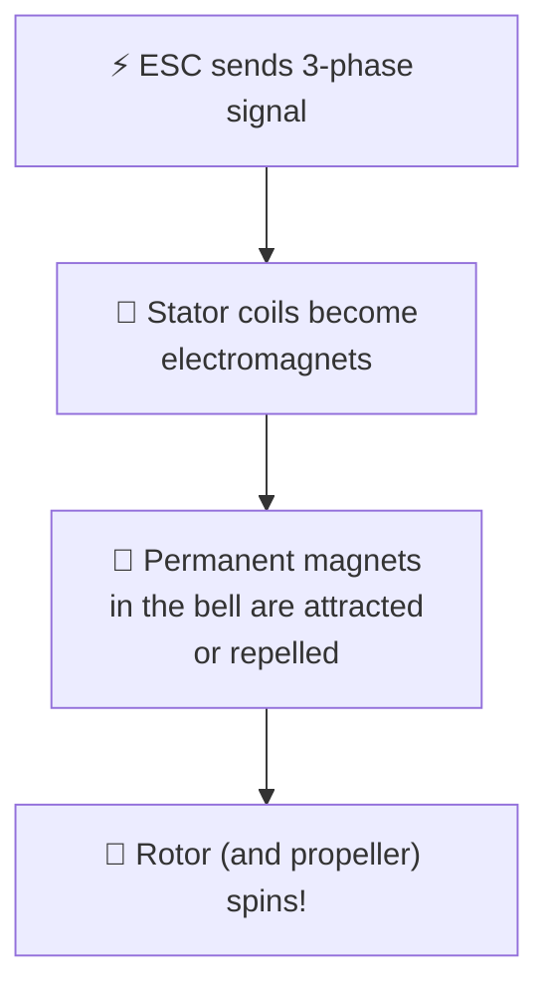

#### Understanding Motor Size

Motors are named with 4 digits, e.g. **2207**:

```
First 2 digits = Stator Diameter (mm) → determines TORQUE
Last 2 digits  = Stator Height (mm)   → determines POWER and heat capacity

Example: 2207 = 22mm wide, 7mm tall
```

| Dimension | Increasing it gives you... | Best for... |
|-----------|--------------------------|------------|
| Diameter | More torque; can swing bigger, heavier props | Lifting payloads, larger drones |
| Height | More power handling, better heat dissipation | High-performance builds |

#### Understanding KV (Motor Velocity Constant)

KV is not a quality rating, it is a speed/torque tradeoff selector. It tells you how many RPM the motor turns per 1 Volt applied, with no load attached.

```
KV = RPM per Volt
Example: A 2400KV motor on 4S battery (14.8V):
Max RPM ≈ 2400 × 14.8 = 35,520 RPM
```

- **High KV** (e.g. 2400KV+) → spins fast → use with **small props on low voltage** (4S) → racing
- **Low KV** (e.g. 1400–1750KV) → slower but more torque → use with **large props on high voltage** (6S/12S) → endurance and payload

#### KV and Voltage

| Battery Voltage | Recommended KV Range | Why |
|----------------|---------------------|-----|
| 4S (~14.8V) | 2300–2800 KV | Lower voltage needs higher KV to reach useful RPM |
| 6S (~22.2V) | 1600–2100 KV | Higher voltage compensates — use lower KV for efficiency |
| 12S (~44.4V) | 400–800 KV | Very high voltage industrial builds; large props |

!> **Temperature Warning:** Motor temperature should never exceed **80°C (176°F)**. Above this, the permanent magnets permanently lose strength (demagnetize), causing irreversible performance loss.

---

### 2.3 Electronic Speed Controller (ESC)

#### What Is an ESC?

The motor needs three-phase alternating current (AC) to spin, but batteries supply direct current (DC). The ESC is the translator, it takes DC from the battery and rapidly switches it to create the three-phase AC the motor needs, at precisely the right frequency to control motor speed.

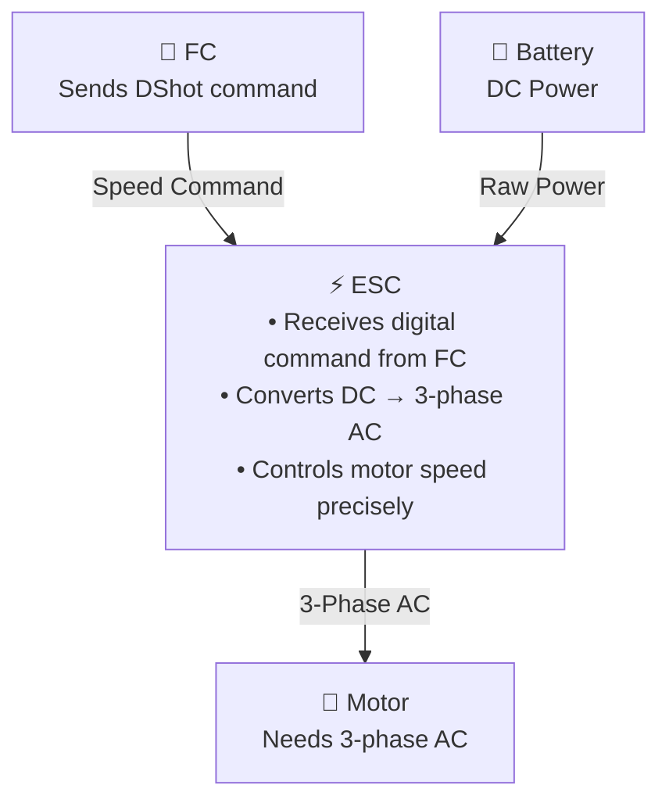

#### ESC Communication Protocols

The protocol determines how the flight controller "talks" to the ESC.

| Protocol | Type | Direction | Latency | Recommendation |
|---------|------|-----------|---------|----------------|
| **PWM / Oneshot125** | Analog | One-way only | High | Legacy avoid on new builds |
| **DShot300** | Digital | Bidirectional | Low | Good for standard builds |
| **DShot600** | Digital | Bidirectional | Very Low | Recommended best balance |
| **DShot1200** | Digital | Bidirectional | Extremely Low | Racing and high-performance |

#### How to Choose ESC Current Rating

The ESC must handle the maximum current your motor can ever draw, with a safety margin:

```
ESC Rating ≥ Motor Max Current × 1.20 to 1.50
(i.e. 20–50% safety margin depending on application)

Example: Motor draws max 35A → ESC should be rated ≥ 42A (using 1.2× margin)
```

!> **Safety Note:** I'm using safety margin of 2.0 as my components are cheap and unreliable but good for hobby grade build.

#### ESC Cooling

ESCs get hot under load. In builds where the ESC sits inside the frame without airflow, temperatures can rise dangerously.

- **Best practice:** Mount ESCs on the arms so propeller downwash (the air pushed down by spinning props) actively cools them.
- **Alternative:** Add dedicated aluminum heatsinks to ESCs inside enclosed frames.

#### ESC Types

| Type | Description | Best For |
|------|-------------|---------|
| **Individual ESC** | One ESC per motor | Large/industrial VTOL, easy replacement |
| **4-in-1 ESC** | All 4 ESCs on one board | Consumer/racing quads; cleaner wiring |

---

## 3. Batteries

### What Is a LiPo Battery?

**LiPo** stands for **Lithium Polymer**. It is the most common type of drone battery because it can discharge very quickly; essential for the burst-current demands of spinning motors.

Think of a battery like a water tank:
- **Voltage (V)** = water pressure higher pressure means more power available per unit of current
- **Capacity (mAh)** = tank size how long it lasts
- **C-rating** = pipe diameter how fast it can release energy

### Battery Voltage: The "S" Count

LiPo cells are grouped in **series** to increase voltage. Each cell is nominally **3.7V**, and we call the total cell count the "S number":

```
1S = 1 cell  = 3.7V  nominal (4.2V fully charged)
2S = 2 cells = 7.4V
4S = 4 cells = 14.8V  ← Common for 5" racing quads
6S = 6 cells = 22.2V  ← Common for cinematic and efficiency builds
12S = 12 cells = 44.4V ← Industrial/large VTOL
```

#### Why Higher Voltage Is More Efficient

Physics tells us that for the same amount of power (watts), higher voltage means lower current:

```
Power (W) = Voltage (V) × Current (A)
Heat Loss = Current² × Resistance   (I²R losses)

Same power at 6S vs 4S:
6S: 22.2V × lower amps = less heat in wires
4S: 14.8V × higher amps = more heat in wires
```

> Running higher voltage for the same power output means less heat in your ESCs and wires, thinner/lighter cables, and better efficiency. This is why professional and industrial drones run 6S, 10S, or 12S.

### Battery Chemistry: LiPo vs Li-ion

| Feature | LiPo (Lithium Polymer) | Li-ion (Lithium-Ion) |
|---------|----------------------|---------------------|
| **Shape** | Flat pouch; easily customized | Cylindrical cells |
| **Discharge rate** | Very high (high C-rating) | Moderate |
| **Energy density** | Medium | High |
| **Voltage sag** | Low; voltage stays stable under load | Moderate |
| **Best for** | Racing, heavy lifting, aggressive flight | Long-range, mapping, endurance (30–60 min flights) |

### Understanding the C-Rating

The **C-rating** tells you how fast the battery can safely discharge relative to its capacity:

```
Maximum Safe Current (A) = Capacity (Ah) × C-Rating

Example: 1500mAh (= 1.5Ah) battery with 50C rating:
Max safe current = 1.5 × 50 = 75A
```

!> If your motors collectively demand more current than 75A, the battery overheats, voltage sags severely, and cell damage occurs.

### Protecting Your Battery

Never drain a LiPo below **3.3V** per cell (3.7V is the safe lower limit). Deep discharge damages the internal chemistry permanently.

```
Safe usable capacity = 80% of rated mAh

Example: 1500mAh battery → use only 1200mAh before landing
```

Configure your flight controller to trigger a **low-voltage warning** (buzzer or OSD alert) before the battery reaches this threshold.

### Wiring & Connectors

Current capacity of wire depends on its thickness. The **AWG standard** is counter-intuitive: **lower number = thicker wire = higher current capacity**.

| Wire AWG | Max Safe Current | Common Use |
|---------|-----------------|------------|
| AWG 10 | 55A | Main battery leads on large builds |
| AWG 12 | 40A | Battery leads on 5" builds |
| AWG 14 | 32A | ESC power wires |
| AWG 20 | 11A | Signal wires, BEC outputs |

> Always use silicone-insulated wire. Silicone remains flexible in cold weather and doesn't melt as easily if wires accidentally touch at high current.

#### Anti-Spark Connectors

When you plug in a LiPo, the sudden inrush of current creates a voltage spike (a spark). This spike can damage the capacitors on your ESCs and FC.

Always use anti-spark connectors such as XT90-S or AS150. These have a built-in pre-charge resistor that limits the inrush current and eliminates the spark.

### Battery Summary

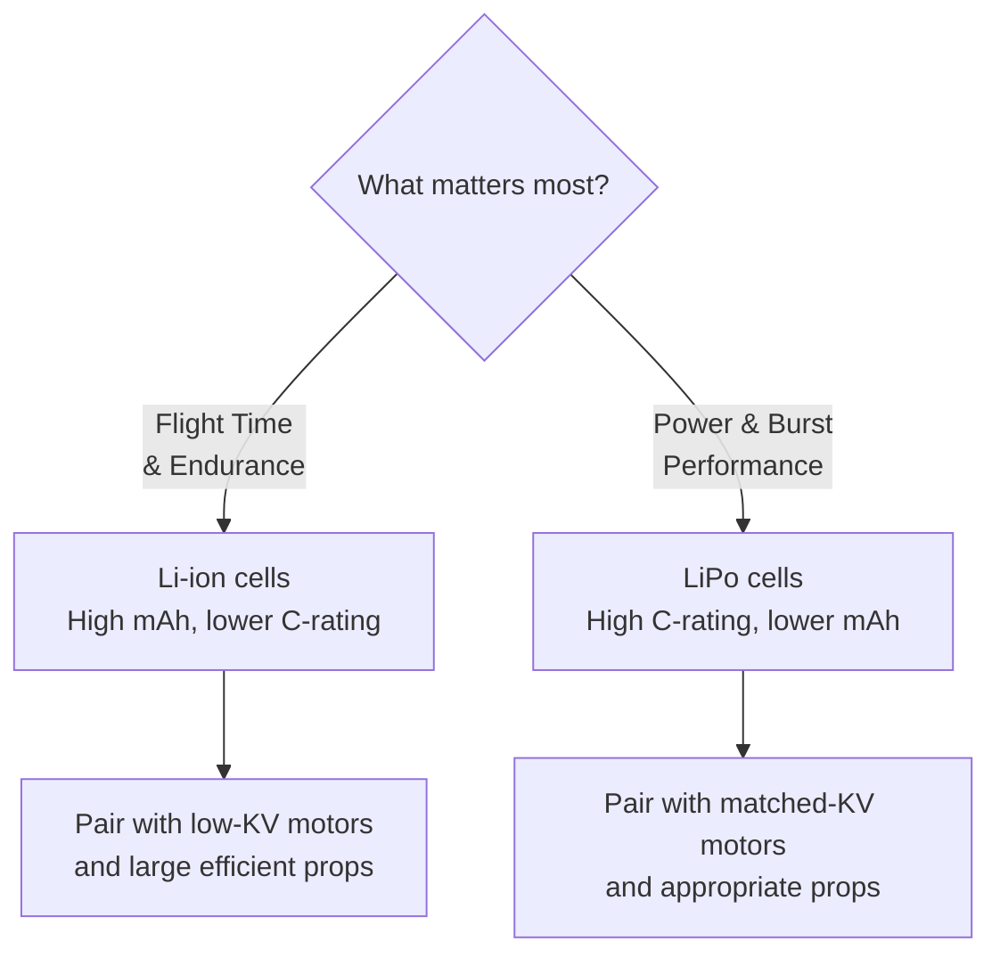

---

## 4. Flight Controller & Frame

### What Is a Flight Controller?

The Flight Controller (FC) is a circuit board containing a processor (MCU) and sensors. It reads those sensors hundreds of times per second and adjusts motor speeds to keep the drone stable and responsive to your commands. Without an FC, a multirotor drone is **physically impossible to fly** — the pilot cannot manually balance all four motors at once.

### How the FC Stabilizes the Drone

The FC runs a **PID control loop**, a mathematical algorithm that continuously calculates the difference between where the drone is and where it should be, then corrects the motor speeds to reduce that difference.

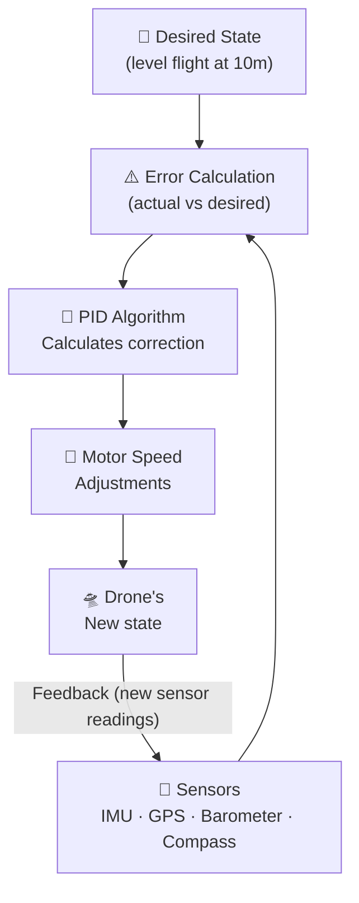

### Sensor Fusion

No single sensor is perfect. The FC uses **sensor fusion**, combining multiple imperfect sensors to get one accurate estimate of position and orientation.

| Sensor | What It Measures | Limitation |
|--------|-----------------|-----------|
| **Gyroscope** (in IMU) | Rotation rate (how fast it's tilting) | Drifts over time |
| **Accelerometer** (in IMU) | Linear acceleration and gravity direction | Noisy and vibration-sensitive |
| **Magnetometer / Compass** | Magnetic north (yaw/heading) | Affected by magnetic interference |
| **Barometer** | Air pressure → altitude | Affected by wind and temperature |
| **GPS** | Absolute latitude/longitude/altitude | Slow update rate; no signal indoors |

The FC software (firmware) blends all of these into one reliable orientation estimate. This is why vibration isolation of the FC is critical, excess vibration fools the accelerometer.

### Choosing the Right Processor (MCU)

The MCU is the brain chip on the FC. Its speed determines how fast the PID loop runs and how many features are supported.

| MCU | Performance  | Recommendation |
|-----|------------|----------------|
| **STM32 F4** | Moderate (168 MHz) | Budget/legacy , limited features |
| **STM32 F7** | Good (216 MHz) | Popular, good for most builds |
| **STM32 H7** | Excellent (480 MHz) | Required for autonomous missions |

### FC Communication Ports

The FC talks to other devices through serial ports and buses:

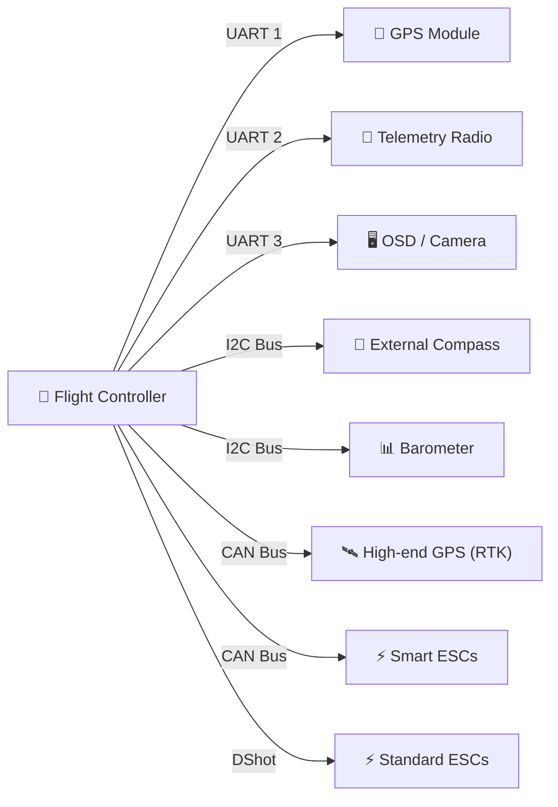

> **I2C vs CAN:** I2C is cheap and simple but sensitive to electrical noise, keep those wires short and away from motor power cables. CAN is the industrial standard used in cars and aircraft: it is noise-resistant and suitable for long cable runs in large VTOL aircraft.

### Autopilot Firmware

The firmware is the software loaded onto the FC. It determines what the drone can do.

| Firmware | Best For | License | Key Strength |
|---------|---------|---------|-------------|
| **ArduPilot** | GPS missions, industrial | GPLv3 | Most mature; vast community |
| **PX4** | Research, Enterprise | BSD (permissive) | Modular; optimal for H7 |
| **Betaflight** | FPV racing, Freestyle | GPLv3 | Low-latency flight feel |

### The Frame

The frame is the skeleton of the drone. Material choice affects stiffness, weight, and repairability.

**Carbon Fiber** is the dominant material for performance builds:
- Extremely high strength-to-weight ratio
- Stiffness can be tuned by adjusting fiber orientation layers
- **Does not flex**, frame flex causes propellers to vibrate asynchronously, which confuses the IMU and causes motor overheating

> Avoid any frame that visibly flexes when you twist the arms. A flex-prone frame will result in oscillations that no amount of PID tuning can fix.

#### Vibration Isolation

Motor vibration is the #1 enemy of the FC's sensors. Even tiny vibrations at motor frequencies can overwhelm the IMU and make flight erratic.

**Solution:** Soft-mount the FC using silicone grommets (called "gummies"). These absorb high-frequency vibration before it reaches the sensors. You can also use double tap.

---

## 5. Radio Link & Communication

### The Two Communication Systems on a Drone

Most drones have **two separate wireless links**:

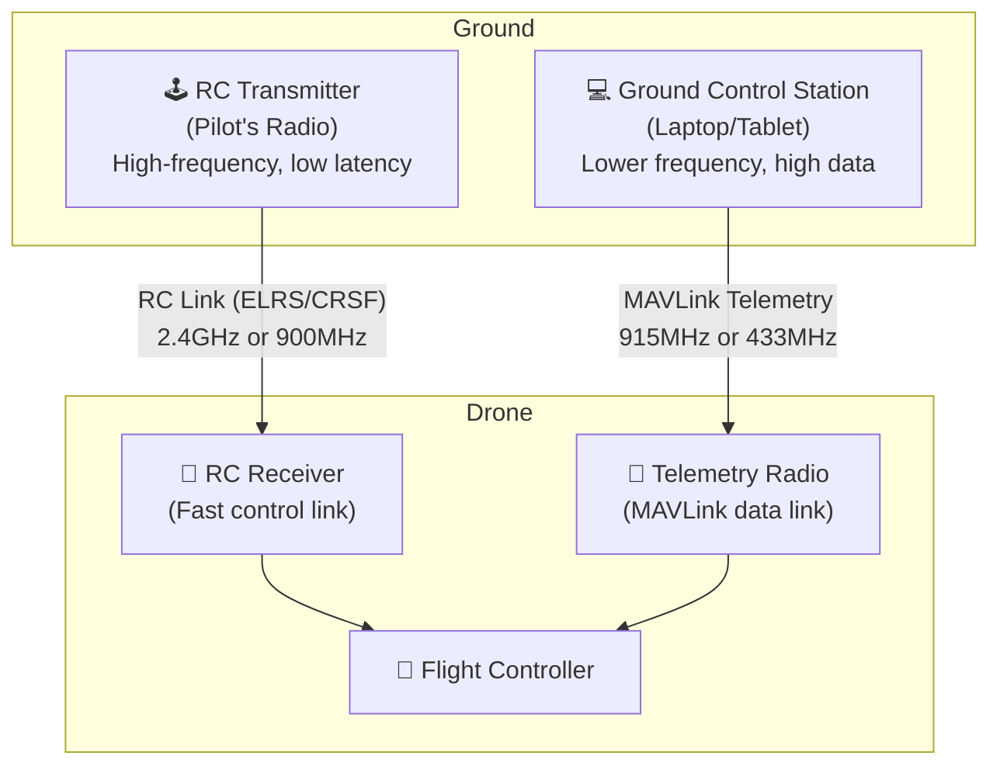

### The RC Control Link

This is the link your radio transmitter uses to send your stick movements to the drone in real time. **Latency is critical** a delay of even 50ms can make a fast drone feel unresponsive.

#### ExpressLRS (ELRS)

[ExpressLRS](https://www.expresslrs.org/) is an open-source, ultra-low-latency radio protocol. It is now the dominant choice for new builds.

- **2.4GHz band:** lower latency, ideal for racing and freestyle up to ~5km
- **900MHz band:** longer range (10–30km+), slight latency increase; ideal for long-range cruising
- **Packet rate:** configurable from 50Hz to 1000Hz (1000 packets per second for racing)
- **Bidirectional:** the drone sends sensor data back to your handset (telemetry)

#### Frequency Hopping & Security

Modern protocols like ELRS use **Spread Spectrum** the signal constantly hops between many frequencies. This makes it nearly impossible to jam or intercept, and prevents interference from other nearby pilots.

**Binding Phrase:** Every ELRS transmitter and receiver must share a unique "binding phrase" a custom password you set at compile/flash time. This ensures only your transmitter can control your drone, even at a crowded flying field.

### MAVLink

While the RC link carries fast, low-data stick commands, the **telemetry link** carries rich flight data at a lower update rate:

- Battery voltage, current, and remaining capacity
- GPS position, altitude, ground speed
- Flight mode, armed status
- Error messages and warnings
- Waypoint mission status

[MAVLink](https://mavlink.io/en/) is the open-source protocol that most autopilots (ArduPilot, PX4) use for this data. It connects the drone to your Ground Control Station (GCS) laptop or tablet.

#### MAVLink Security Notes

| Property | Detail |
|---------|--------|
| **Message signing** | MAVLink can sign messages to verify the sender's identity, preventing unauthorized command injection |
| **Encryption** | MAVLink is **not encrypted by default** anyone with compatible hardware can read your telemetry data. If mission confidentiality is required, use a secure radio link or hardware encryption layer |

### Failsafe

**Always configure a failsafe.** If the RC link drops (you flew out of range, battery died in the transmitter, interference), the drone must know what to do:

| Failsafe Mode | Behavior | Best For |
|--------------|---------|---------|
| **Drop / Disarm** | Motors cut immediately | Low-altitude acrobatics over open land |
| **RTH (Return to Home)** | Climbs to safe altitude, flies home, lands | GPS-equipped long-range missions |
| **Hold** | Maintains position using GPS | Survey / inspection missions |

> Always test your failsafe on the ground before flying. Turn off your transmitter with the drone armed but motors NOT spinning, and watch that it responds correctly.

---

## 6. Ground Control Stations

A **Ground Control Station (GCS)** is the software on your laptop or tablet that gives you a map view of the drone, lets you plan autonomous missions, tune the FC, and monitor live telemetry.

| Software | Best For | Connection |
|---------|---------|-----------|
| **Mission Planner** | Deep ArduPilot tuning, mission planning | MAVLink / USB |
| **QGroundControl** | Modern UI for PX4 and ArduPilot | MAVLink |
| **Betaflight Configurator** | PID tuning for racing/freestyle | USB |

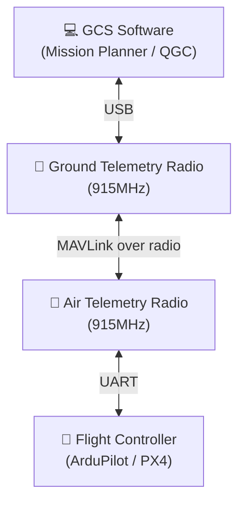

---

## 7. Specialized Sensors & Payloads

Once basic flight is working, sensors turn the drone from a flying toy into a tool. The required sensors depend entirely on the application.

| Application | Essential Sensors | Purpose |
|-------------|-----------------|---------|
| **FPV Racing** | FPV Camera, VTX (Video Transmitter), Goggles | Live video feed to pilot's headset |
| **Autonomous Navigation** | GNSS (GPS), IMU, Telemetry radio | Waypoint missions, Return-to-Home |
| **3D Mapping** | LiDAR or stereo camera, high-res RGB camera | Point clouds, terrain models |
| **Agriculture / Spraying** | RTK GPS, LiDAR (obstacle avoidance), flow meter | Centimeter-level precision, spray control |
| **Search & Rescue** | Thermal camera, spotlight, loudspeaker | Night vision, victim detection |

### GPS / GNSS

GPS gives the drone a fixed reference point in the world. Without GPS:
- No stable hover (the drone drifts with wind)
- No Return to Home
- No autonomous waypoint missions

**RTK GPS** (Real-Time Kinematic) achieves centimeter-level accuracy by correcting satellite data with a fixed ground station. Required for precision agriculture and survey.

---

## 8. Build Workflow

Use this workflow as a checklist. The order matters — each step's output feeds the next step's input.

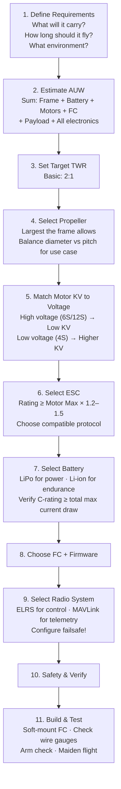

Good Luck !