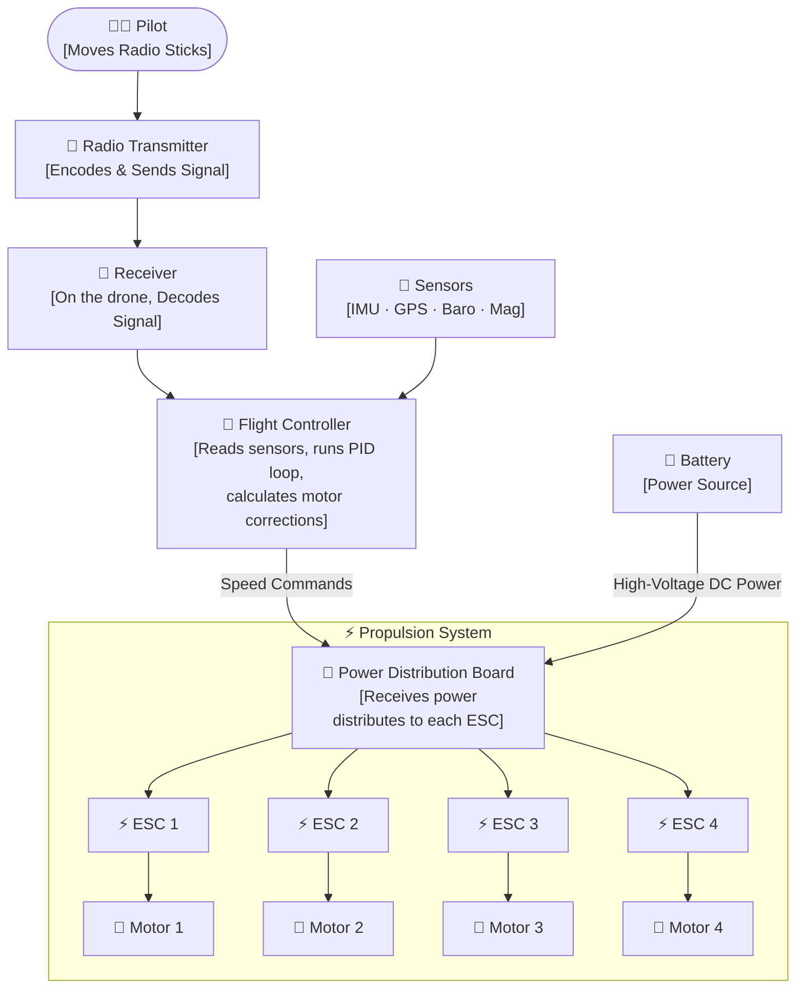
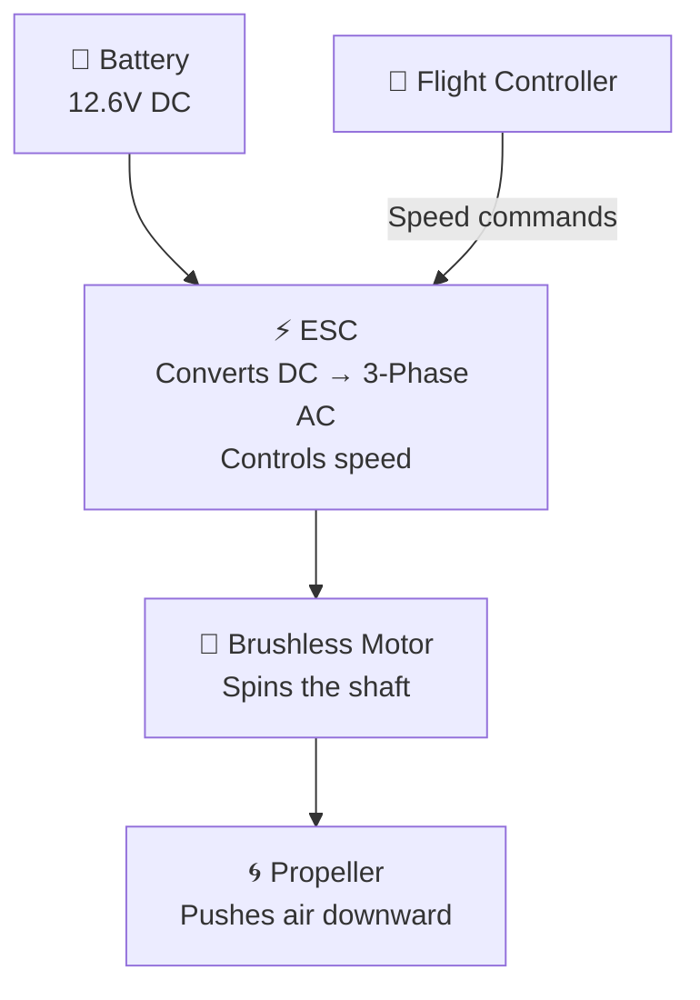
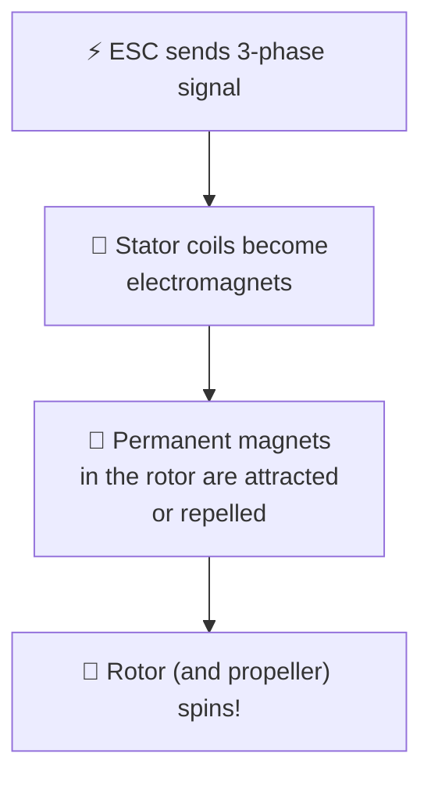
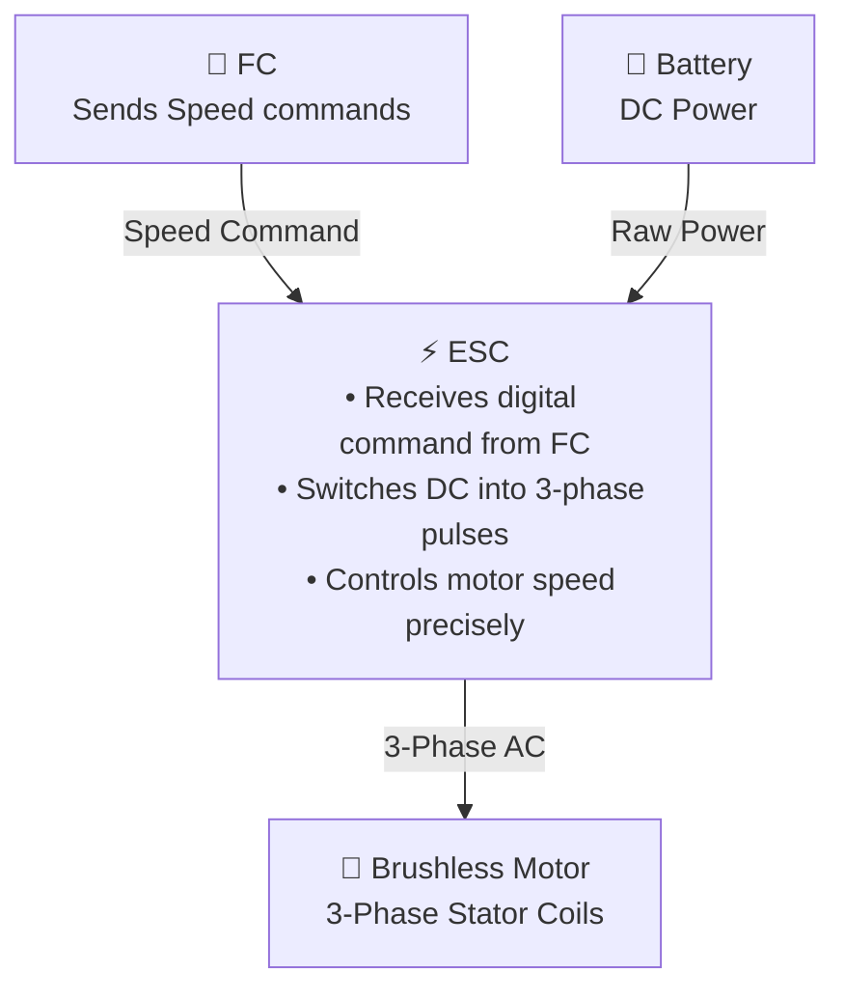
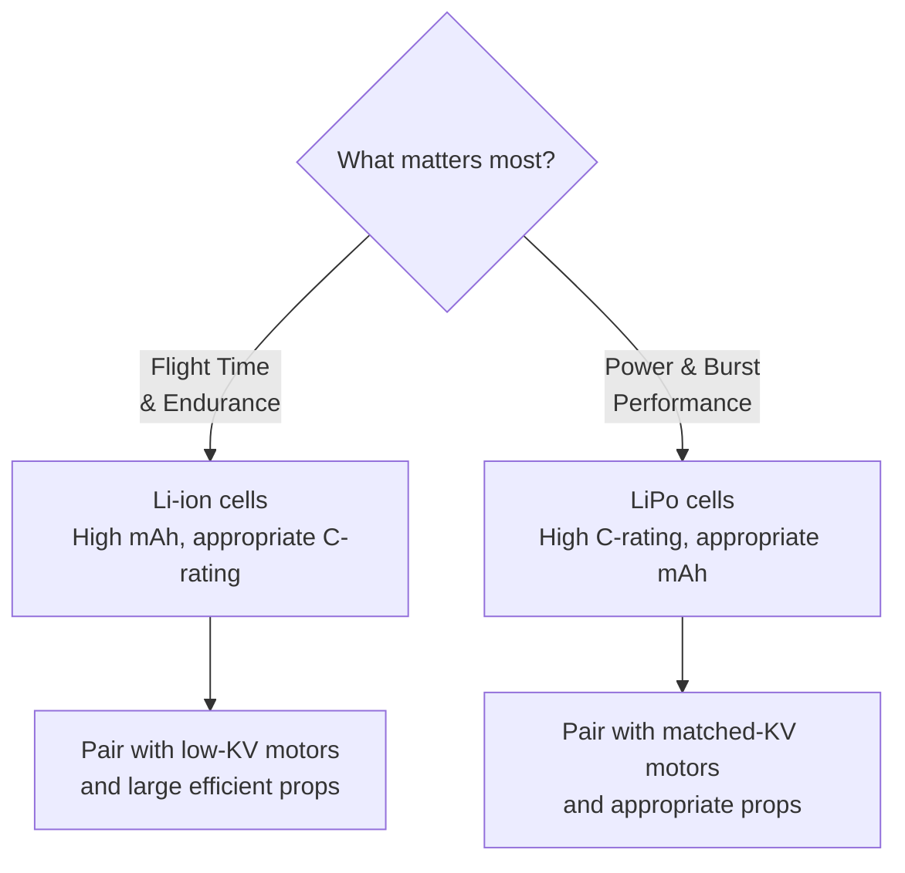
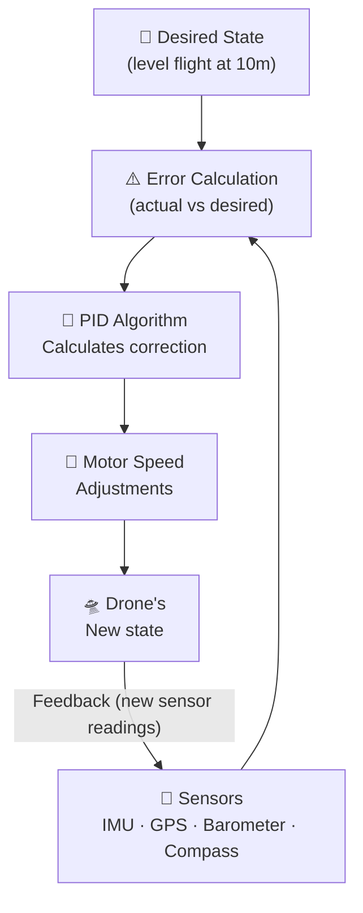
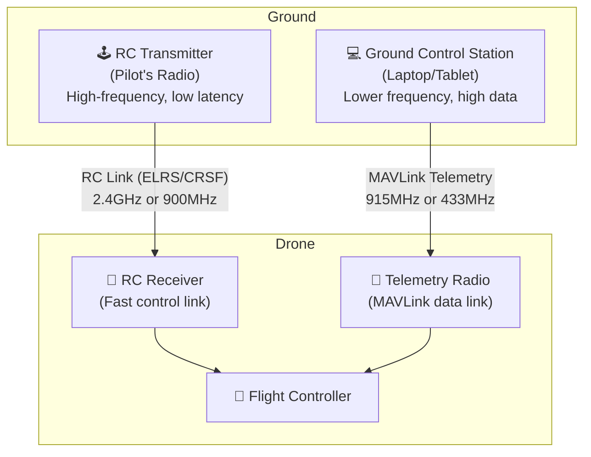
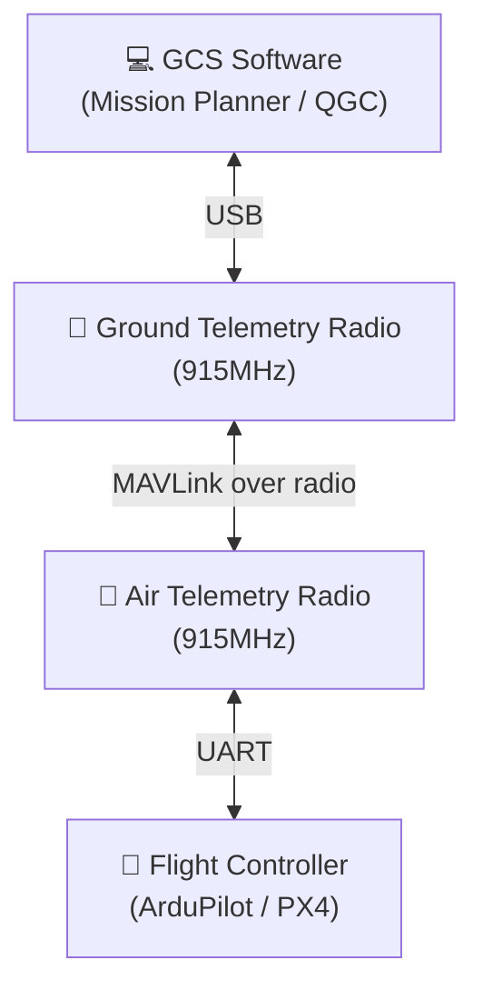

# Basic Guide

Welcome! This guide walks you through the fundamentals of the drones like how it works, physics, maths behind it, parts and how you should choose them for your specific build.

## Glossary

| Acronym | Full Name | Plain-English Meaning |
|---------|-----------|----------------------|
| **AUW** | All-Up Weight | The total weight of the drone at any moment in flight (frame + battery + payload + everything) |
| **AWG** | American Wire Gauge | A wire-thickness standard. Lower number = thicker wire. AWG 10 is thicker than AWG 18. |
| **BEC** | Battery Eliminator Circuit | A small voltage regulator that steps down the high battery voltage (e.g. 22V) to the safe 5V used by electronics |
| **CAN** | Controller Area Network | A highly reliable communication bus used to connect sensors and smart devices; resistant to electrical noise |
| **ESC** | Electronic Speed Controller | The device between the battery and the motor. It translates a "speed command" from the flight controller into actual motor rotation |
| **FC** | Flight Controller | The circuit board that is the brain of the drone. It reads sensors and adjusts motor speeds to keep the vehicle stable |
| **IMU** | Inertial Measurement Unit | A chip that combines a gyroscope (rotation) and accelerometer (tilt/movement) to know orientation in 3D space |
| **INS** | Inertial Navigation System | A system tracking position and motion relative to a starting point using internal sensors, to allow operation in GPS-denied areas. |
| **I2C** | Inter-Integrated Circuit | A two-wire communication protocol for connecting sensors at short distances |
| **KV** | Motor Velocity Constant | How many RPM a motor spins per 1 Volt applied (with no load). Higher KV = faster but less torque |
| **mAh** | Milliampere-hour | A measure of battery capacity, how much energy is stored. |
| **MCU** | Microcontroller Unit | The main processor chip on the FC (e.g. STM32 H7). Think of it as the CPU |
| **PDB** | Power Distribution Board | Distributes high-current power from the battery to each ESC/motor individually |
| **Sag** | Voltage Sag | The temporary drop in battery voltage when motors demand a lot of current at once |
| **SPI** | Serial Peripheral Interface | A high-speed, synchronous communication protocol used to connect sensors to the MCU; faster than I2C. |
| **TWR** | Thrust-to-Weight Ratio | Total maximum thrust divided by total weight. A 2:1 TWR means the drone can produce twice its own weight in thrust |
| **UART** | Universal Async Receiver/Transmitter | A serial communication port on the FC used to connect GPS, telemetry radios, etc |
| **VTOL** | Vertical Take-Off and Landing | Any aircraft that can lift straight up, hover, and land straight down. Quadcopters are a common example |

## How a Drone Works

A drone is a closed-loop control system: the pilot gives a command → the brain processes it → the motors react.


```mermaid
flowchart TD
    Pilot(["🧑‍✈️ Pilot\n[Moves Radio Sticks]"])
    TX["📡 Radio Transmitter\n[Encodes & Sends Signal]"]
    RX["📶 Receiver\n[On the drone, Decodes Signal]"]
    FC["🧠 Flight Controller\n[Reads sensors, runs PID loop,\ncalculates motor corrections]"]
    BAT["🔋 Battery\n[Power Source]"]
    SENSORS["🔭 Sensors\n[IMU · GPS · Baro · Mag]"]

    Pilot --> TX --> RX --> FC
    SENSORS --> FC

    subgraph PROP["⚡ Propulsion System"]
        PDB["🔌 Power Distribution Board\n[Receives power\ndistributes to each ESC]"]
        PDB --> ESC1["⚡ ESC 1"] --> M1["🔄 Motor 1"]
        PDB --> ESC2["⚡ ESC 2"] --> M2["🔄 Motor 2"]
        PDB --> ESC3["⚡ ESC 3"] --> M3["🔄 Motor 3"]
        PDB --> ESC4["⚡ ESC 4"] --> M4["🔄 Motor 4"]
    end

    FC  -->|"Speed Commands"| PDB
    BAT -->|"High-Voltage DC Power"| PDB
```

The pilot sends radio signal to the drone's receiver, which forwards these signal to the Flight Controller (FC). The FC reads its sensor data to measure the drone's current orientation, then commands each of the four ESCs to adjust motor speeds. This entire loop runs hundreds of times per second.

!> **Note:** The FC's speed command appear to route through the PDB to ESCs. In reality, the ESCs connects directly to the FC to send speed commands; the diagram was simplified to avoid visual clutter.

## 1. Physics & Aerodynamics

A drone stays in the air because its motors push down on air hard enough to lift the entire weight of the drone up.

```
Lift (Thrust) ≥ Weight
```

If your motors cannot produce enough thrust equal to it's weight, the drone cannot take off.

#### Thrust-to-Weight Ratio (TWR)

```
TWR = Total Maximum Thrust ÷ Total Weight (AUW)
```

**The golden rule is a 2:1 TWR.** This means your motors together must produce **atleast twice** the drone's weight in thrust. At hover, the motors run at 50% throttle, leaving a full 50% in reserve for climbing, maneuvering, and fighting wind gusts.

#### Disk Loading

Large propellers moving air slowly are more efficient than small propellers moving air fast. Always choose the largest propeller your frame physically allows.

The formal name for this is **Disk Loading**, the thrust per unit area of the propeller disk. Lower disk loading = more efficient = longer flight time.

## 2. Motors, ESCs & Props

The propulsion system has three parts that must be selected together: the **Motor**, the **ESC**, and the **propellers** or **props**. Getting just one of these wrong can cause overheating, crashes, or poor performance.


```mermaid
flowchart TD
    BAT["🔋 Battery\n12.6V DC"] --> ESC["⚡ ESC\nConverts DC → 3-Phase AC\nControls speed"] --> MOT["🔄 Brushless Motor\nSpins the shaft"] --> PROP["🌀 Propeller\nPushes air downward"]
    FC["🧠 Flight Controller"] -->|"Speed commands"| ESC
```

### 2.1 Propellers

#### What Is a Propeller?

A propeller is a rotating airfoil (like a spinning wing). As it rotates, it creates a pressure difference that pushes air downward, generating upward lift.

#### Reading Propeller Specifications

Propellers are labelled with two key numbers, e.g. **5045** or **5×4.5**:

```
[Diameter in inches] × [Pitch in inches] × [Number of blades]
Example: 5045-3 = 5" diameter, 4.5" pitch, 3 blades
```

- **Diameter:** The total tip-to-tip size. Larger diameter = more thrust at low RPM = more efficient for hovering.
- **Pitch:** Imagine the propeller as a screw. Pitch is how far forward one full rotation would theoretically push air. Higher pitch = more speed, more current draw, more heat generated in ESC.
- **Blade count:** More blades add thrust and reduce noise but also add drag and current draw. 2-blade props are efficient; 3-blade props are a balance; 4+ blades are for specific applications.

#### Effect of Propeller Parameters

| Change | Effect on Thrust | Effect on Efficiency | Effect on Speed |
|--------|-----------------|---------------------|-----------------|
| ↑ Diameter | ↑ More thrust | ↑ More efficient | ↓ Slower response |
| ↑ Pitch | ↑ More thrust | ↓ Less efficient | ↑ Faster top speed |
| ↑ Blade count | ↑ More thrust | ↓ Slightly less | ↓ Slower response |

#### Material

Most propellers are made from **polycarbonate plastic** (light and flexible, good for beginners since they bounce rather than shatter on crashes) or **carbon fiber** (stiffer, more efficient, and more expensive, but they shatter and the fragments are sharp and hazardous).

!> **Safety Note:** Carbon fiber propellers can cause serious injuries. Never hold armed drone where spinning props could contact you.

### 2.2 Motors

#### What Is a Brushless Motor?

Drone motors are **brushless DC motors**. Unlike the simple brushed motors in toy cars, brushless motors have no mechanical contact points (brushes) that wear out. Instead, the ESC switches the electromagnetic coils electronically, this is why the ESC is required.

A brushless motor has two parts:
- **Stator** the fixed ring of copper coils wound around iron laminations. This stays still.
- **Rotor** the outer cup with permanent magnets. This spins.


```mermaid
flowchart TD
    ESC["⚡ ESC sends 3-phase signal"]
    COIL["🔵 Stator coils become\nelectromagnets"]
    MAG["🔴 Permanent magnets\nin the rotor are attracted\nor repelled"]
    SPIN["🔄 Rotor (and propeller) spins!"]
    ESC --> COIL --> MAG --> SPIN
```

#### Understanding Motor Size

Motors are named with 4 digits, e.g. **2212**:

```
First 2 digits = Stator Diameter (mm) → determines TORQUE
Last 2 digits  = Stator Height (mm)   → determines POWER and heat capacity

Example: 2212 = 22mm wide, 12mm tall
```

| Dimension | Increasing it gives you... | Best for... |
|-----------|--------------------------|------------|
| Diameter | More torque; can swing bigger, heavier props | Lifting payloads, larger drones |
| Height | More power handling, better heat dissipation | High-performance builds |

#### Understanding KV (Motor Velocity Constant)

KV rating tells you how many RPM the motor turns per 1 Volt applied, with no load attached. No load means props off.

### 2.3 Electronic Speed Controller (ESC)

#### What Is an ESC?

The ESC takes direct current (DC) from the battery and rapidly switches it between the three motor wires in timed pulses. By rapidly cycling which coils receive current, the ESC creates a rotating magnetic field that drives the motor, controlling its speed through pulse timing.


```mermaid
flowchart TD
    BAT["🔋 Battery\nDC Power"]
    ESC["⚡ ESC\n• Receives digital command from FC\n• Switches DC into 3-phase pulses\n• Controls motor speed precisely"]
    MOT["🔄 Brushless Motor\n3-Phase Stator Coils"]
    FC["🧠 FC\nSends Speed commands"]
    FC -->|Speed Command| ESC
    BAT -->|Raw Power| ESC
    ESC -->|3-Phase AC| MOT
```

#### ESC Communication Protocols

The protocol determines how the flight controller talks to the ESC.

| Protocol | Type | Direction | Latency |
|---------|------|-----------|---------|
| **PWM** | Analog | Unidirectional | High |
| **OneShot** | Analog | Unidirectional | Medium |
| **MultiShot** | Analog | Unidirectional | Low |
| **DShot** | Digital | Bidirectional | Low |

#### How to Choose ESC Current Rating

The ESC must handle the maximum current your motor can ever draw, with a safety margin:

```
ESC Rating ≥ Motor Max Current × 1.20 to 1.50
(i.e. 20–50% safety margin depending on application)

Example: Motor draws max 35A → ESC should be rated ≥ 42A (using 1.2× margin)
```

!> **Safety Note:** I'm using safety margin of 2.0 as my components are cheap and unreliable but good for learning and hobby grade build.

## 3. Batteries

### What Is a LiPo Battery?

**LiPo** stands for **Lithium Polymer**. It is the most common type of drone battery because it can discharge very quickly; essential for the burst-current demands of spinning motors.

Think of a battery like a water tank:
- **Voltage (V)** = Water Pressure, how strongly the electricity is pushed
- **Capacity (mAh)** = Water Volume, how much total water is inside the tank
- **C-rating** = Max Flow Capacity, pipe diameter how fast it can release energy

!> **Note:** The "water tank" analogy is used here for conceptual clarity; ensure you understand the underlying technical principles as well.

### Battery Voltage: The "S" Count

LiPo cells are grouped in **series** to increase voltage. Each cell is nominally **3.7V**, and we call the total cell count the "S number":

```
1S = 1 cell  = 3.7V  nominal (4.2V fully charged)
2S = 2 cells = 7.4V
3S = 3 cells = 12.6V
4S = 4 cells = 14.8V  ← Common for 5" racing quads
6S = 6 cells = 22.2V  ← Common for cinematic and efficiency builds
12S = 12 cells = 44.4V ← Industrial/large VTOL
```

#### Why Higher Voltage Is More Efficient

Physics tells us that for the same amount of power, higher voltage means lower current:

```
Power (W) = Voltage (V) × Current (A)
Heat Loss = Current² × Resistance   (I²R losses)

Same power at 6S vs 4S:
6S: 22.2V × lower amps = less heat in wires
4S: 14.8V × higher amps = more heat in wires
```

> Running higher voltage for the same power output means less heat in your ESCs and wires, thinner/lighter cables, and better efficiency.

### Battery Chemistry: LiPo vs Li-ion

| Feature | LiPo (Lithium Polymer) | Li-ion (Lithium-Ion) |
|---------|----------------------|---------------------|
| **Shape** | Flat pouch; easily customized | Cylindrical cells |
| **Discharge rate** | Very high (high C-rating) | Moderate |
| **Energy density** | Medium | High |
| **Voltage sag** | Low; voltage stays stable under load | Moderate |
| **Best for** | Racing, heavy lifting, aggressive flight | Long-range, mapping, endurance (30–60 min flights) |

### Understanding the C-Rating

The **C-rating** tells you how fast the battery can safely discharge relative to its capacity:

```
Maximum Safe Current (A) = Capacity (Ah) × C-Rating

Example: 1500mAh (= 1.5Ah) battery with 50C rating:
Max safe current = 1.5 × 50 = 75A
```

!> If your motors collectively demand more current than 75A, the battery overheats, voltage sags severely, and cell damage occurs.

### Protecting Your Battery

Never drain a LiPo below **3.3V** per cell (3.5V is the safe lower limit). Deep discharge damages the internal chemistry permanently.

Configure your flight controller to trigger a **low-voltage warning** (buzzer or OSD alert) before the battery reaches this threshold.

### Battery Summary


```mermaid
flowchart TD
    Q{What matters most?}
    Q -->|"Flight Time\n& Endurance"| A["Li-ion cells\nHigh mAh, appropriate C-rating"]
    Q -->|"Power & Burst\nPerformance"| B["LiPo cells\nHigh C-rating, appropriate mAh"]
    A --> C["Pair with low-KV motors\nand large efficient props"]
    B --> D["Pair with matched-KV motors\nand appropriate props"]
```

## 4. Flight Controller & Frame

### What Is a Flight Controller?

The FC is a circuit board containing a Microcontroller Unit (MCU) and sensors. It reads those sensors hundreds of times per second and adjusts motor speeds to keep the drone stable and responsive to your commands.

### How the FC Stabilizes the Drone

The FC runs a **PID control loop**, a mathematical algorithm that continuously calculates the difference between where the drone is and where it should be, then corrects the motor speeds to reduce that difference.


```mermaid
flowchart TD
    WANT["🎯 Desired State\n(level flight at 10m)"]
    SENSORS["📡 Sensors\nIMU · GPS · Barometer · Compass"]
    ERROR["⚠️ Error Calculation\n(actual vs desired)"]
    PID["🧮 PID Algorithm\nCalculates correction"]
    MOTORS["🔄 Motor Speed\nAdjustments"]
    DRONE["🛸 Drone's \nNew state"]

    WANT --> ERROR
    SENSORS --> ERROR
    ERROR --> PID --> MOTORS --> DRONE
    DRONE -->|"Feedback (new sensor readings)"| SENSORS
```

### Sensor Fusion

No single sensor is perfect. The FC uses **sensor fusion**, combining multiple imperfect sensors to get one accurate estimate of position and orientation.

| Sensor | What It Measures | Limitation |
|--------|-----------------|-----------|
| **Gyroscope** (in IMU) | Rotation rate (how fast it's tilting) | Drifts over time |
| **Accelerometer** (in IMU) | Linear acceleration and gravity direction | Noisy and vibration-sensitive |
| **Magnetometer / Compass** | Magnetic north (yaw/heading) | Affected by magnetic interference of ESC wires|
| **Barometer** | Air pressure → altitude | Affected by wind and temperature |
| **GPS** | Absolute latitude/longitude/altitude | Slow update rate; no signal indoors |

The FC firmware blends all of these into one reliable orientation estimate. This is why vibration isolation of the FC/sensors is critical, excess vibration fools the accelerometer. Soft-mount the FC using silicone grommets (called "gummies"). These absorb high-frequency vibration before it reaches the sensors. You can also use double tap.

### Autopilot Firmware

The firmware is the software loaded onto the FC. It determines what the drone can do.

| Firmware | License | Key Strength |
|---------|---------|-------------|
| **ArduPilot** | GPLv3 | Most mature; vast community |
| **PX4** | BSD (permissive) | Modular and Modern |
| **Betaflight** | GPLv3 | Low-latency FPVs |

### The Frame

The frame is the skeleton of the drone. Material choice affects stiffness, weight, and repairability.

**Carbon Fiber** is the dominant material for performance builds:
- Extremely high strength-to-weight ratio
- Stiffness can be tuned by adjusting fiber orientation layers
- Does not flex, frame flex causes propellers to vibrate asynchronously, which confuses the IMU and causes motor overheating

> Avoid any frame that visibly flexes when you twist the arms. A flex-prone frame will result in oscillations that no amount of PID tuning can fix.

## 5. Radio Link & Communication

### The Two Communication Systems on a Drone

Drones can have **two separate wireless links**:


```mermaid
flowchart TD
    subgraph Ground
        TX["🕹️ RC Transmitter\n(Pilot's Radio)\nHigh-frequency, low latency"]
        GCS["💻 Ground Control Station\n(Laptop/Tablet)\nLower frequency, high data"]
    end

    subgraph Drone
        RX["📶 RC Receiver\n(Fast control link)"]
        TEL["📡 Telemetry Radio\n(MAVLink data link)"]
        FC["🧠 Flight Controller"]
    end

    TX -->|"RC Link (ELRS/CRSF)\n2.4GHz or 900MHz"| RX
    GCS -->|"MAVLink Telemetry\n915MHz or 433MHz"| TEL
    RX --> FC
    TEL --> FC
```

### The RC Control Link

This is the link your radio transmitter uses to send your stick movements to the drone in real time. **Latency is critical** a delay of even 50ms can make a fast drone feel unresponsive.

#### ExpressLRS (ELRS)

[ExpressLRS](https://www.expresslrs.org/) is an open-source, ultra-low-latency radio protocol. It is now the dominant choice for new builds.

- **2.4GHz band:** lower latency, ideal for racing and freestyle up to ~5km
- **900MHz band:** longer range (10–30km+), slight latency increase; ideal for long-range cruising
- **Packet rate:** configurable from 50Hz to 1000Hz (1000 packets per second for racing)
- **Bidirectional:** the drone sends sensor data back to your handset (telemetry)

#### Frequency Hopping & Security

Modern protocols like ELRS use **Spread Spectrum** the signal constantly hops between many frequencies.

**Binding Phrase:** Every ELRS transmitter and receiver must share a unique "binding phrase" a custom password you set at compile/flash time. This ensures only your transmitter can control your drone.

### MAVLink

[MAVLink](https://mavlink.io/en/) s the lightweight, open-source messaging protocol used by autopilots (like ArduPilot and PX4) to communicate with Ground Control Stations (GCS) on laptops, tablets, or phones.

While the RC link carries high-speed stick commands from your transmitter to the drone, the MAVLink telemetry link provides a two-way channel for rich flight data and mission planning at a lower update rate:

- Battery voltage, current draw, and remaining capacity
- GPS coordinates, altitude, airspeed, and ground speed
- Active flight mode, arming state, and system warnings
- Real-time waypoint tracking and uploading flight plans

### Failsafe

If the RC link drops (you flew out of range or battery died in the transmitter or radio interference), the drone must know what to do:

| Failsafe Mode | Behavior | Best For |
|--------------|---------|---------|
| **Drop / Disarm** | Motors cut immediately | Low-altitude acrobatics over open land |
| **RTH (Return to Home)** | Climbs to safe altitude, flies home, lands | GPS-equipped long-range missions |
| **Hold** | Maintains position using GPS | Survey / inspection missions |

## 6. Ground Control Stations

A **Ground Control Station (GCS)** is the software on your laptop or tablet that gives you a map view of the drone, lets you plan autonomous missions, tune the FC, and monitor live telemetry.

| Software | Best For |
|---------|---------|
| **Mission Planner** | Deep ArduPilot tuning, mission planning |
| **QGroundControl** | Modern UI for PX4 and ArduPilot |
| **Betaflight Configurator** | PID tuning for racing/freestyle |


```mermaid
flowchart TD
    GCS["💻 GCS Software\n(Mission Planner / QGC)"]
    TEL_G["📡 Ground Telemetry Radio\n(915MHz)"]
    TEL_A["📡 Air Telemetry Radio\n(915MHz)"]
    FC["🧠 Flight Controller\n(ArduPilot / PX4)"]

    GCS <-->|USB| TEL_G
    TEL_G <-->|"MAVLink over radio"| TEL_A
    TEL_A <-->|UART| FC
```

## 7. Specialized Sensors & Payloads

| Application | Essential Sensors | Purpose |
|-------------|-----------------|---------|
| **FPV Racing** | FPV Camera, VTX (Video Transmitter), Goggles | Live video feed to pilot's headset |
| **Navigation** | GNSS (GPS), IMU, Telemetry radio | Waypoint missions, Return-to-Home |
| **3D Mapping** | LiDAR or stereo camera, high-res RGB camera | Point clouds, terrain models |
| **Agriculture / Spraying** | RTK GPS, LiDAR (obstacle avoidance), flow meter | Centimeter-level precision, spray control |
| **Search & Rescue** | Thermal camera, spotlight, loudspeaker | Night vision, victim detection |

### GPS / GNSS

GPS gives the drone a fixed reference point in the world. Without GPS:
- No stable hover (the drone drifts with wind)
- No Return to Home
- No autonomous waypoint missions

**RTK GPS** (Real-Time Kinematic) achieves centimeter-level accuracy by correcting satellite data with a fixed ground station. Required for precision agriculture and survey.

Good Luck !

*Last Updated: 7th Aug 2026*