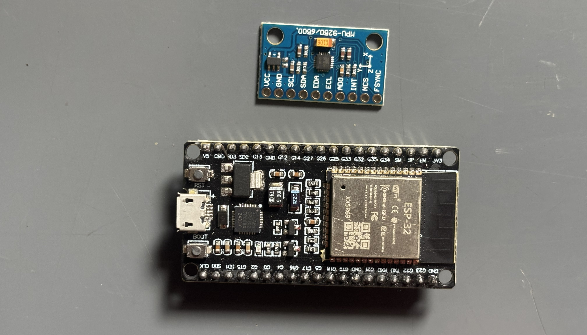
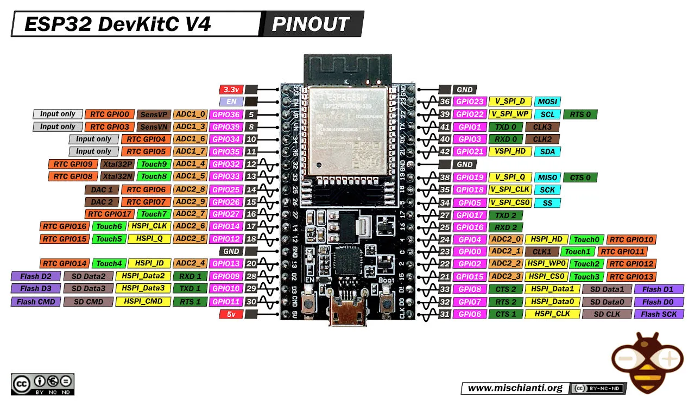

# ESP32 / ESP32-S3 Hardware Setup

This guide covers building a custom flight controller using an ESP32 breakout board.

This example uses a generic **ESP32 DevKitC**.

## Parts List

<table>
  <thead>
    <tr>
      <th>Part</th>
      <th>Specs</th>
      <th>Price* (₹)</th>
      <th>Purchase</th>
    </tr>
  </thead>
  <tbody>
    <tr>
      <td rowspan="4">ESP32</td>
      <td>38-Pin Type-C CP2102 Driver (Recommended)</td>
      <td>599</td>
      <td><a href="https://www.flyrobo.in/esp32-38-pin-development-board-cp2102-type-c-wifi-and-bluetooth?tracking=RlWmZUVohGHCRsAhWTrZyDfyKC3myArPWKC9tC7cAxOjEeW8PFqjN5SbOiOkNscf" target="_blank">Buy</a></td>
    </tr>
    <tr>
      <td>38-Pin Micro USB CP2102 Driver</td>
      <td>599</td>
      <td><a href="https://www.flyrobo.in/esp32-38-pin-development-board-dual-core-wifi-bluetooth-micro-usb?tracking=RlWmZUVohGHCRsAhWTrZyDfyKC3myArPWKC9tC7cAxOjEeW8PFqjN5SbOiOkNscf" target="_blank">Buy</a></td>
    </tr>
    <tr>
      <td>38-Pin Micro-USB CH9102 Driver</td>
      <td>599</td>
      <td><a href="https://www.flyrobo.in/esp32-development-board-wifibluetooth-dual-core-38-pin-ch9102-micro-soldered?tracking=RlWmZUVohGHCRsAhWTrZyDfyKC3myArPWKC9tC7cAxOjEeW8PFqjN5SbOiOkNscf" target="_blank">Buy</a></td>
    </tr>
    <tr>
      <td>30-Pin Micro-USB CH9102 Driver</td>
      <td>499</td>
      <td><a href="https://www.flyrobo.in/esp32-development-board-wifibluetooth-dual-core-30-pin-ch9102-micro-soldered?tracking=RlWmZUVohGHCRsAhWTrZyDfyKC3myArPWKC9tC7cAxOjEeW8PFqjN5SbOiOkNscf" target="_blank">Buy</a></td>
    </tr>
    <tr>
      <td rowspan="2">MPU6500</td>
      <td>-</td>
      <td>237</td>
      <td><a href="https://www.flyrobo.in/mpu6500-gy-6500-6dof-6-axis-accelerometer-gyro-sensor?tracking=RlWmZUVohGHCRsAhWTrZyDfyKC3myArPWKC9tC7cAxOjEeW8PFqjN5SbOiOkNscf" target="_blank">Buy</a></td>
    </tr>
    <tr>
      <td>-</td>
      <td>-</td>
      <td>-</td>
    </tr>
    <tr>
      <td rowspan="12">Miscellaneous</td>
      <td>Soldering Iron</td>
      <td>265</td>
      <td><a href="https://www.flyrobo.in/solder-iron-25w-yellow?tracking=RlWmZUVohGHCRsAhWTrZyDfyKC3myArPWKC9tC7cAxOjEeW8PFqjN5SbOiOkNscf" target="_blank">Buy</a></td>
    </tr>
    <tr>
      <td>Soldering Wire</td>
      <td>245</td>
      <td><a href="https://www.flyrobo.in/solder-wire-40-gsm-for-most-electrical-repair-soldering-purpose?tracking=RlWmZUVohGHCRsAhWTrZyDfyKC3myArPWKC9tC7cAxOjEeW8PFqjN5SbOiOkNscf" target="_blank">Buy</a></td>
    </tr>
    <tr>
      <td>Soldering Flux</td>
      <td>21</td>
      <td><a href="https://www.flyrobo.in/noel-yellow-soldering-flux-paste-10gm?tracking=RlWmZUVohGHCRsAhWTrZyDfyKC3myArPWKC9tC7cAxOjEeW8PFqjN5SbOiOkNscf" target="_blank">Buy</a></td>
    </tr>
    <tr>
      <td>Single Side Perf Board</td>
      <td>31</td>
      <td><a href="https://www.flyrobo.in/12_x_18cm_pcb_prototyping_printed_circuit?tracking=RlWmZUVohGHCRsAhWTrZyDfyKC3myArPWKC9tC7cAxOjEeW8PFqjN5SbOiOkNscf" target="_blank">Buy</a></td>
    </tr>
    <tr>
      <td>Double Side Perf Board</td>
      <td>43</td>
      <td><a href="https://www.flyrobo.in/5-x-7-cm-double-side-universal-pcb-prototype-board?tracking=RlWmZUVohGHCRsAhWTrZyDfyKC3myArPWKC9tC7cAxOjEeW8PFqjN5SbOiOkNscf" target="_blank">Buy</a></td>
    </tr>
    <tr>
      <td>Male To Male Jumper Wire</td>
      <td>53</td>
      <td><a href="https://www.flyrobo.in/10cm_male_to_male_jumper_cable_wire_for_arduino?tracking=RlWmZUVohGHCRsAhWTrZyDfyKC3myArPWKC9tC7cAxOjEeW8PFqjN5SbOiOkNscf" target="_blank">Buy</a></td>
    </tr>
    <tr>
      <td>Female To Female Jumper Wire</td>
      <td>53</td>
      <td><a href="https://www.flyrobo.in/40pcs_10cm_female_to_female_jumper_cable_wire_for_arduino?tracking=RlWmZUVohGHCRsAhWTrZyDfyKC3myArPWKC9tC7cAxOjEeW8PFqjN5SbOiOkNscf" target="_blank">Buy</a></td>
    </tr>
    <tr>
      <td>Male To Female Jumper Wire</td>
      <td>53</td>
      <td><a href="https://www.flyrobo.in/10cm_male_to_female_jumper_cable_wire_for_arduino?tracking=RlWmZUVohGHCRsAhWTrZyDfyKC3myArPWKC9tC7cAxOjEeW8PFqjN5SbOiOkNscf" target="_blank">Buy</a></td>
    </tr>
    <tr>
      <td>Wire Cutter</td>
      <td>60</td>
      <td><a href="https://www.flyrobo.in/wire-stripper-and-cutter?tracking=RlWmZUVohGHCRsAhWTrZyDfyKC3myArPWKC9tC7cAxOjEeW8PFqjN5SbOiOkNscf" target="_blank">Buy</a></td>
    </tr>
    <tr>
      <td>Male Double Row Header Pins</td>
      <td>7 x 5</td>
      <td><a href="https://www.flyrobo.in/2.54mm-double-row-straight-male-header-strip-2x40p?tracking=RlWmZUVohGHCRsAhWTrZyDfyKC3myArPWKC9tC7cAxOjEeW8PFqjN5SbOiOkNscf" target="_blank">Buy</a></td>
    </tr>
    <tr>
      <td>Male Single Row Header Pins</td>
      <td>8 x 5</td>
      <td><a href="https://www.flyrobo.in/40-pin-male-header-connector-strip-breakable-5pcs?tracking=RlWmZUVohGHCRsAhWTrZyDfyKC3myArPWKC9tC7cAxOjEeW8PFqjN5SbOiOkNscf" target="_blank">Buy</a></td>
    </tr>
    <tr>
      <td>Female Single Row Header Pins</td>
      <td>17 x 5</td>
      <td><a href="https://www.flyrobo.in/2mm-pitch-female-burg-strip-40-pin-5-pcs?tracking=RlWmZUVohGHCRsAhWTrZyDfyKC3myArPWKC9tC7cAxOjEeW8PFqjN5SbOiOkNscf" target="_blank">Buy</a></td>
    </tr>
  </tbody>
</table>

**prices as of 7th Aug 2026*

## Soldering

1. Get the required parts.

2. Solder header pins to the board, matching the pin groups used in the wiring table below.

## Wiring

Connect components as outlined in the table below:

<table>
  <thead>
    <tr>
      <th>Component</th>
      <th>MCU Pin</th>
      <th>Part Pin</th>
      <th>Protocol</th>
    </tr>
  </thead>
  <tbody>
    <tr>
      <td rowspan="10"><strong>IMU</strong></td>
      <td>3.3 V</td>
      <td>VCC</td>
      <td rowspan="4">I2C</td>
    </tr>
    <tr>
      <td>GND</td>
      <td>GND</td>
    </tr>
    <tr>
      <td>GPIO22</td>
      <td>SCL</td>
    </tr>
    <tr>
      <td>GPIO21</td>
      <td>SDA</td>
    </tr>
    <tr>
      <td>3.3V</td>
      <td>VCC</td>
      <td rowspan="6">SPI</td>
    </tr>
    <tr>
      <td>GND</td>
      <td>GND</td>
    </tr>
    <tr>
      <td>GPIO18</td>
      <td>SCL</td>
    </tr>
    <tr>
      <td>GPIO23</td>
      <td>SDA</td>
    </tr>
    <tr>
      <td>GPIO19</td>
      <td>ADO</td>
    </tr>
    <tr>
      <td>GPIO5</td>
      <td>NCS</td>
    </tr>
    <tr>
      <td rowspan="4"><strong>Radio</strong></td>
      <td>GPIO4</td>
      <td>PPM/CH1</td>
      <td rowspan="4">PPM</td>
    </tr>
    <tr>
      <td>5 V</td>
      <td>Power</td>
    </tr>
    <tr>
      <td>GND</td>
      <td>GND</td>
    </tr>
    <tr>
      <td>-</td>
      <td>-</td>
    </tr>
    <tr>
      <td rowspan="4"><strong>ESC</strong></td>
      <td>GPIO25</td>
      <td>SIGNAL (ESC1)</td>
      <td rowspan="4">PWM/OneShot125</td>
    </tr>
    <tr>
      <td>GPIO26</td>
      <td>SIGNAL (ESC2)</td>
    </tr>
    <tr>
      <td>GPIO32</td>
      <td>SIGNAL (ESC3)</td>
    </tr>
    <tr>
      <td>GPIO33</td>
      <td>SIGNAL (ESC4)</td>
    </tr>
  </tbody>
</table>

!> **Warning**: Cut or remove the positive (red) power wire from all ESC signal connectors. Connecting them directly to the board will cause voltage back-feeding, potentially damaging your ESCs or the MCU.

## Firmware Flash & Verification

Go to the [Initial Setup Guide](content/quadcopter.md#_2-development-environment), select your board ESP32, complete initial setup. Once done, follow the verification steps below to ensure everything works.

1. Connect the ESP32 to your laptop via USB and flash the [Janflight firmware](https://github.com/oyegunmen/JanFlight/blob/main/src/ESP32/JanFlight_v1.0.0/JanFlight_v1.0.0.ino).

2. Onboard LED Indicators:
    * Three quick blinks indicating the start of the setup.
    * Two quick blinks indicating the start of the main loop.
    * Consistent 1-second interval blinking confirming the loop is running.

!> **Warning:** On the 38-pin ESP32 DevKitC, the onboard blue LED is physically hardwired to GPIO 1, which is the exact same pin used for the USB Serial Transmit (TX) line. You cannot use both simultaneously. Attempting to blink the onboard LED while sending data to the Serial Monitor may not print data.

3. Open the code in the Arduino IDE, scroll down to the main loop, and uncomment the following debug functions one by one, flashing the code each time to verify data in the Serial Monitor:
    * `printRadioData()`
    * `printRollPitchYaw()`
    * `printMotorCommands()`

If you are seeing data being printed in your serial monitor then your connections are fine.

Congratulations, your ESP32 based flight controller is ready for flying!

*Last Updated: 7th Aug 2026*
