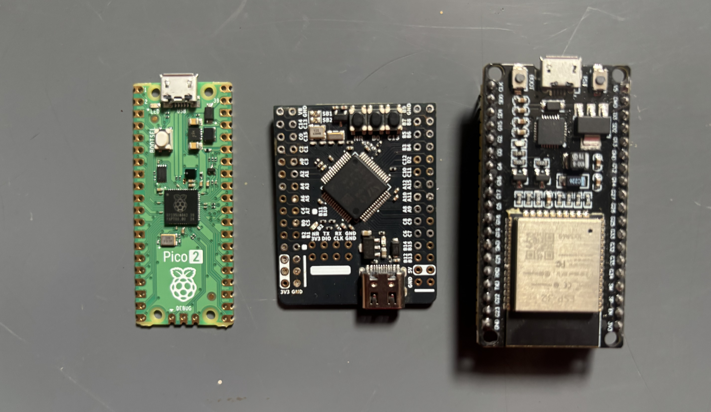

# Getting Started

See guide according to your breakout board to build your flight controller.

## Default JanFlight Breakout Boards

| Board | ESP32 DevKitC | Raspberry Pi Pico 2 | STM32F405RGT6 |
|-------------|-----------------|-----------------|-----------------|
| **Board Size** | 55 * 28 mm | 51 * 21 mm | 42 * 33 mm |
| **Board Weight** | 6.9 g | 3.0 g | 12 g |
| **Board Pins** | 38 pins | 40 pins | 45 pins |
| **PWM** | 16 (8 LEDC timers each with 2 output pins) | 24 | 14 |
| **Available UART** | 3 | 8 (2 + 6*PIO) +USB Serial debug | 4 USART, 2 UART |
| **Available SPI** | 2 | 2 | 3 |
| **Available I2C** | 2 | 2 | 3 |
| **MCU** | ESP32 | RP2350 | STM32F405 |
| **Processor** | 2 core LX6 240MHz | 2 core M33 150MHz (overclock 300MHz) | ARM Cortex-M4 168MHz |
| **FPU** | 1 core FPU | 2 core FPU | 1 core FPU |
| **RAM** | 320K data, 132K instruction, 64K cache | 520K | 192K SRAM |
| **Flash** | 2-16M QuadSPI | 4M QuadSPI | 1024K Flash |
| **Link** | [Guide](content/stm32-getting-started.md) | [Guide](content/esp32-getting-started.md) | [Guide](content/rp2350-getting-started.md) |

Code is pre-configured for these default boards, while other microcontrollers from the same family require custom pin declarations in the code.

*Last Updated: 22th July 2026*