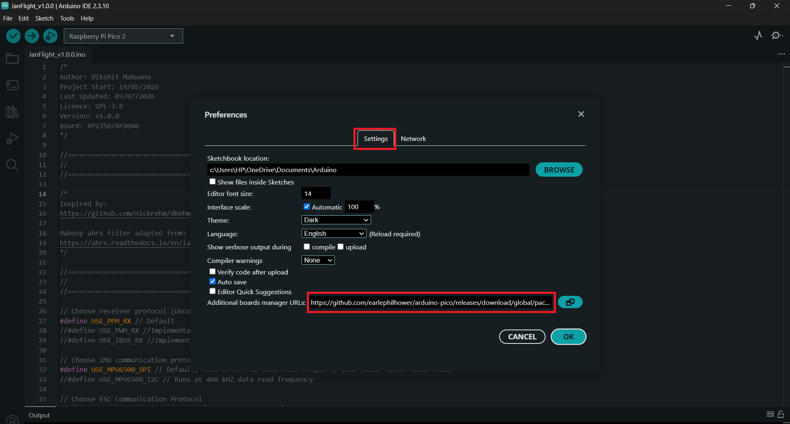
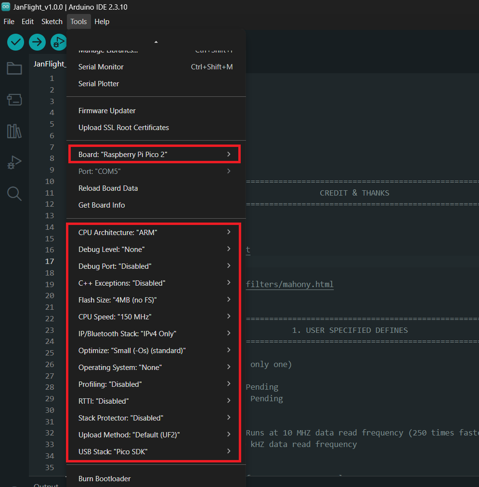
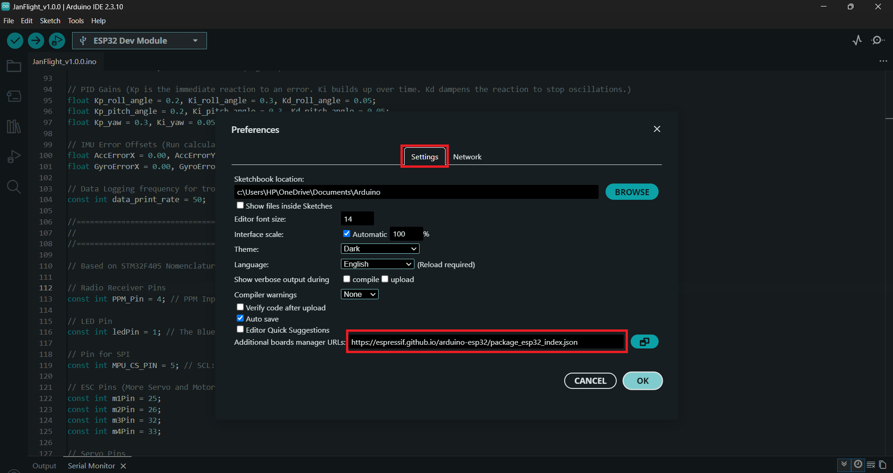
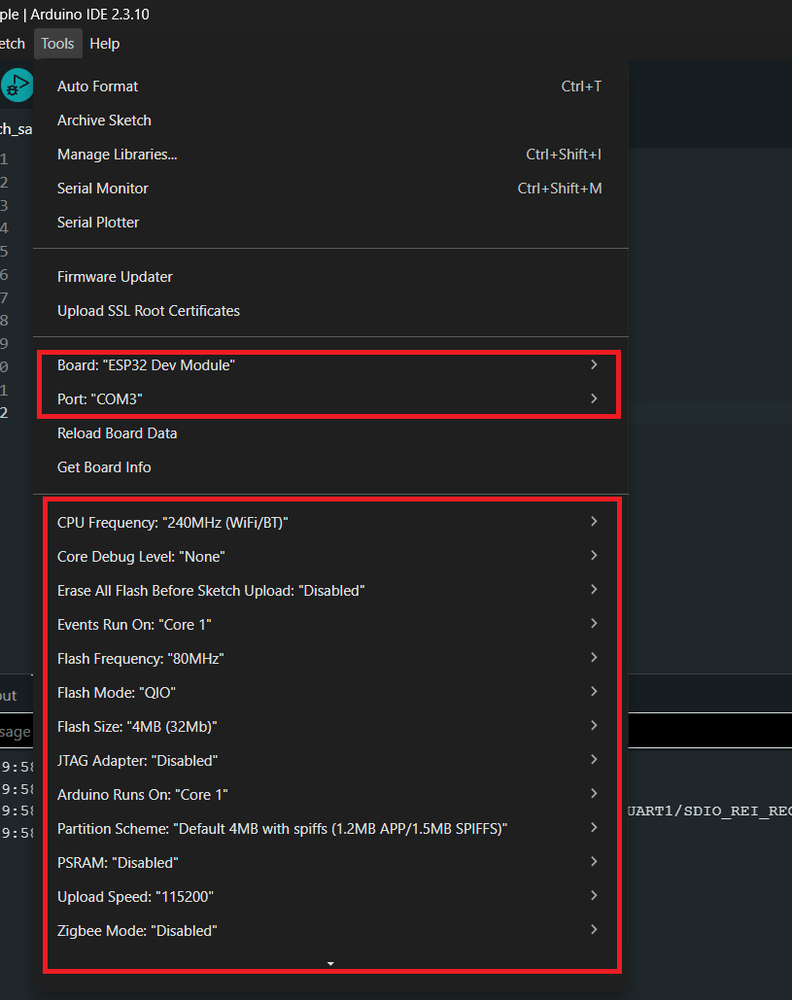
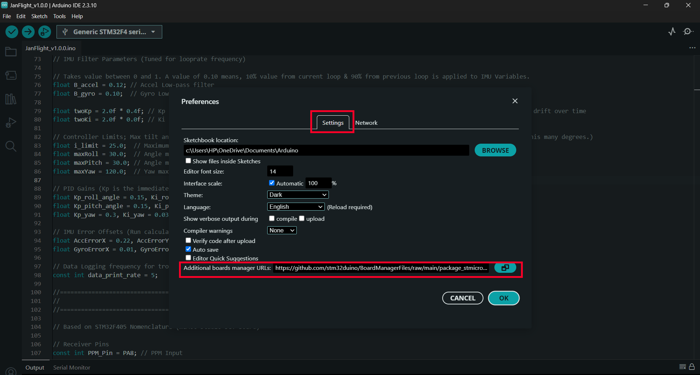
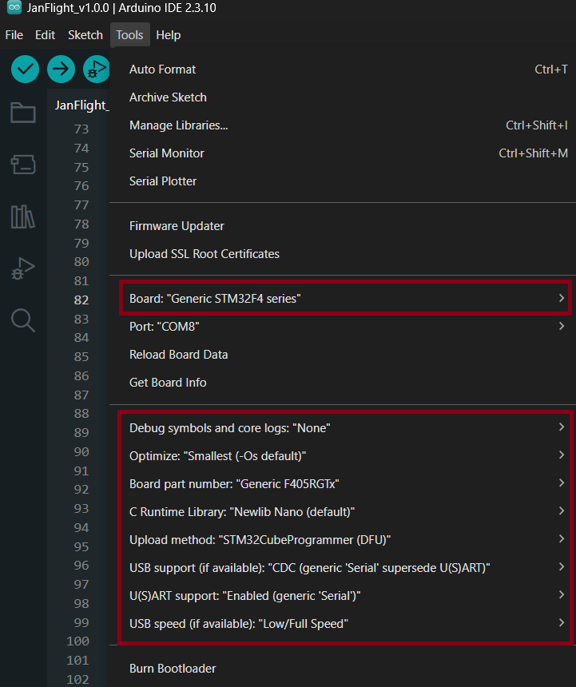
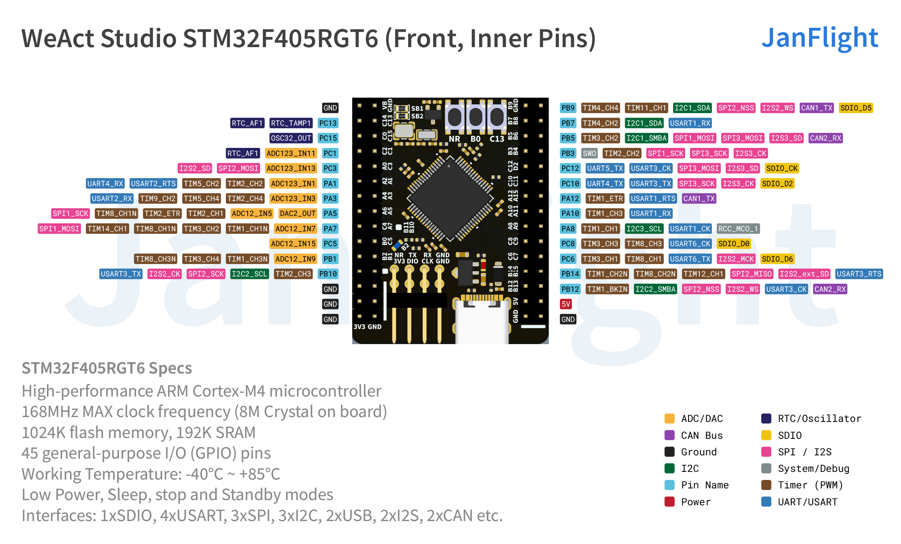
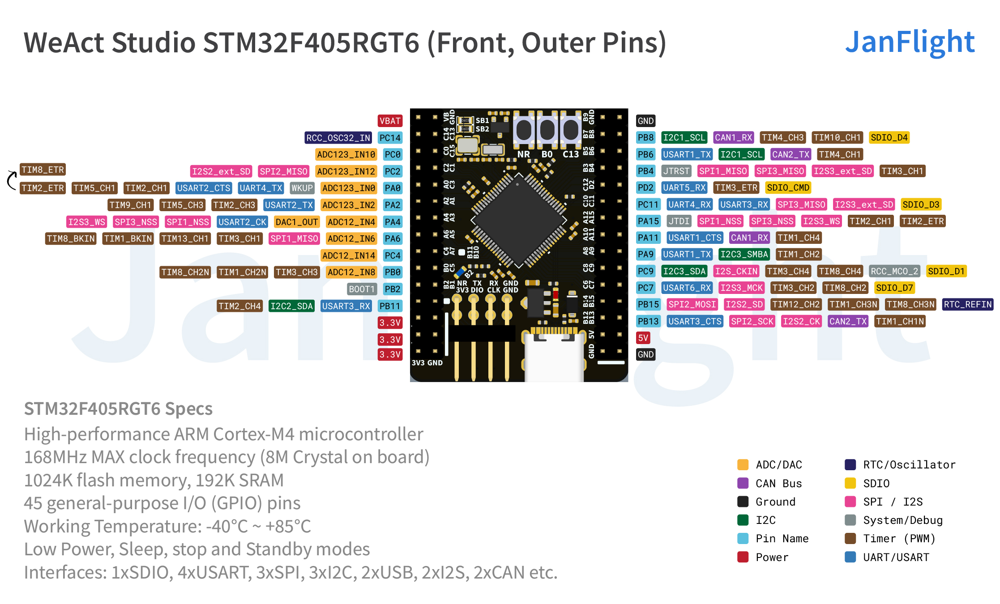

# Quadcopter

1. Get the required hardware
2. Development Environment
3. Configuration
4. Calibrate
5. Compile & Upload
6. FLY!

## 1. Get the required hardware

#### Bill of Material

<table>
  <thead>
    <tr>
      <th>Part</th>
      <th>Specs</th>
      <th>Price* (₹)</th>
      <th>Purchase</th>
    </tr>
  </thead>
  <tbody>
    <tr>
      <td>Flight Controller</td>
      <td>Build guide for <a href="/content/rp2350-getting-started.md">RP2350</a>/<a href="/content/esp32-getting-started.md">ESP32</a>/<a href="/content/stm32-getting-started.md">STM32</a></td>
      <td>-</td>
      <td>-</td>
    </tr>
    <tr>
      <td>Radio</td>
      <td>FlySky FS-i6 2.4G TX with FS-iA6B RX</td>
      <td>5459</td>
      <td><a href="https://www.flyrobo.in/flysky-fs-i6-2.4g-6ch-afhds-transmitter-with-fs-ia6b-receiver-for-rc-fpv-drone?tracking=RlWmZUVohGHCRsAhWTrZyDfyKC3myArPWKC9tC7cAxOjEeW8PFqjN5SbOiOkNscf" target="_blank">Buy</a></td>
    </tr>
    <tr>
      <td>Battery</td>
      <td>3S Lipo 2200mAh</td>
      <td>1619</td>
      <td><a href="https://www.flyrobo.in/absd-lipo-battery-11.1v-2200mah-3s-30c?tracking=RlWmZUVohGHCRsAhWTrZyDfyKC3myArPWKC9tC7cAxOjEeW8PFqjN5SbOiOkNscf" target="_blank">Buy</a></td>
    </tr>
    <tr>
      <td>Frame</td>
      <td>F450</td>
      <td>599</td>
      <td><a href="https://www.flyrobo.in/dji-f450-quadcopter-frame-kit-with-integrated-pcb?tracking=RlWmZUVohGHCRsAhWTrZyDfyKC3myArPWKC9tC7cAxOjEeW8PFqjN5SbOiOkNscf" target="_blank">Buy</a></td>
    </tr>
    <tr>
      <td>Power Module</td>
      <td>XT60 Connector</td>
      <td>570</td>
      <td><a href="https://www.flyrobo.in/apm_pixhawk_power_module_with_xt60?tracking=RlWmZUVohGHCRsAhWTrZyDfyKC3myArPWKC9tC7cAxOjEeW8PFqjN5SbOiOkNscf" target="_blank">Buy</a></td>
    </tr>
    <tr>
      <td>ESC x 4</td>
      <td>30A</td>
      <td>388</td>
      <td><a href="https://www.flyrobo.in/simonk_30a_2-3s_brushless_esc_for_rc?tracking=RlWmZUVohGHCRsAhWTrZyDfyKC3myArPWKC9tC7cAxOjEeW8PFqjN5SbOiOkNscf" target="_blank">Buy</a></td>
    </tr>
    <tr>
      <td>Brushless Motors x 4</td>
      <td>A2212 1000KV</td>
      <td>413</td>
      <td><a href="https://www.flyrobo.in/a2212_1000kv_brushless_motor_for_rc_airplane?tracking=RlWmZUVohGHCRsAhWTrZyDfyKC3myArPWKC9tC7cAxOjEeW8PFqjN5SbOiOkNscf" target="_blank">Buy</a></td>
    </tr>
    <tr>
      <td>Propellers x 2</td>
      <td>1045</td>
      <td>58</td>
      <td><a href="https://www.flyrobo.in/1045_propeller_10in_10x4.5_for_drone?tracking=RlWmZUVohGHCRsAhWTrZyDfyKC3myArPWKC9tC7cAxOjEeW8PFqjN5SbOiOkNscf" target="_blank">Buy</a></td>
    </tr>
    <tr>
      <td>Battery Strap</td>
      <td>30 cm</td>
      <td>63</td>
      <td><a href="https://www.flyrobo.in/readytosky-30cm-nylon-strap-belt-for-rc-lipo-battery?tracking=RlWmZUVohGHCRsAhWTrZyDfyKC3myArPWKC9tC7cAxOjEeW8PFqjN5SbOiOkNscf" target="_blank">Buy</a></td>
    </tr>
  </tbody>
</table>

**prices as of 7th Aug 2026*

## 2. Development Environment
Download the latest version of the [Arduino IDE](https://www.arduino.cc/en/software/) for your operating system.

### RP2040 / RP2350

Open your Arduino IDE and follow these steps to add RP2350 support:

1. Open Arduino IDE, go to **File > Preferences**. Under the Settings tab, locate the **Additional boards manager URLs** field and paste this exact link:

```Arduino
https://github.com/earlephilhower/arduino-pico/releases/download/global/package_rp2040_index.json
```



2. Open **Tools > Board > Boards Manager**. In the search bar, type **rp2040**. Locate **Raspberry Pi Pico/RP2040/RP2350** by Earle F. Philhower, III and click **Install**.

3. Go to **Tools > Board > Raspberry Pi RP2040/RP2350 Boards** and select **Raspberry Pi Pico 2**.

4. Go to **Tools > Port** and select the port your board enumerates.



### ESP32 / ESP32-S3

Open your Arduino IDE and follow these steps to add ESP32 support:

1. Open Arduino IDE, go to **File > Preferences**. Under the Settings tab, locate the **Additional boards manager URLs** field and paste this exact link:

```Arduino
https://espressif.github.io/arduino-esp32/package_esp32_index.json
```



2. Open **Tools > Board > Boards Manager**. In the search bar, type **esp32**. Locate **esp32 by Espressif Systems** and click **Install**.

3. Go to **Tools > Board > ESP32 Arduino** and select **ESP32 Dev Module** (this matches most generic WROOM-32 DevKit boards; pick your board's exact name if listed separately).

4. Go to **Tools > Upload Speed** and set it to **921600**. If you see repeated "Connecting..." failures during upload, drop this to **115200**.

5. Go to **Tools > Port** and select the COM port your board enumerates as once connected via USB.



!> **Info**: Your laptop might need the Virtual COM Port driver installed if it doesn't automatically detect the board when flashing; just the standard [CP210x](https://www.silabs.com/software-and-tools/usb-to-uart-bridge-vcp-drivers?tab=downloads)/[CH340](https://sparks.gogo.co.nz/ch340.html) driver for your OS if your board isn't detected automatically.

### STM32

Open your Arduino IDE and follow these steps to add STM32 support:

1. Open Arduino IDE, Go to **File > Preferences** Under the Settings tab, locate the **Additional boards manager URLs** field and paste this exact link:

```Arduino
https://github.com/stm32duino/BoardManagerFiles/raw/main/package_stmicroelectronics_index.json
```



2. Open **Tools > Board > Boards Manager**. In the search bar, type **STM32**. Locate STM32 MCU based boards by **STMicroelectronics** and click **Install**.

3. Go to **Tools > Board > STM32 Boards (STM32Duino)** and select **Generic STM32F4** series.

4. Go to **Tools > Board part number** and select **Generic F405RGTx**.

5. Go to **Tools > U(S)ART support** and change the setting to **Enabled (generic 'Serial')**. This activates USB CDC support so you can stream raw telemetry directly through your USB cable.



!> **Info**: Your laptop might need the [Virtual COM Port driver](https://www.st.com/en/development-tools/stsw-stm32102.html) installed if it doesn't automatically detect the board when flashing via DFU.

## 3. Configuration
Download [RP2350](https://github.com/oyegunmen/JanFlight/blob/main/src/RP2350/JanFlight_v1.0.0/JanFlight_v1.0.0.ino)/[ESP32](https://github.com/oyegunmen/JanFlight/blob/main/src/ESP32/JanFlight_v1.0.0/JanFlight_v1.0.0.ino)/[STM32](https://github.com/oyegunmen/JanFlight/blob/main/src/STM32/JanFlight_v1.0.0/JanFlight_v1.0.0.ino) based firmware from GitHub.

(a) **Update the Pin Declaration:** Refer to your board's pinout diagram to determine the correct pins for your needs. Navigate to the section 4 of the code and change the pin assignments to match your respective board.





b) **Adjust the Control Mixer:** Locate the `controlMixer()` function. This is where your radio control inputs map to the motor pins you just defined. Leave the default for a standard QuadX drone, or simply change the plus and minus signs inside this function to match your custom motor layout and rotation setup.

## 4. Calibrate
Connect your board via USB, select your COM port, and click Upload. Once complete, keep the IMU perfectly flat and uncomment `calculate_IMU_error()` in `setup()`.

Open the Serial Monitor to read your calibration offsets, data will be printed in bottom output panel, copy those numbers into the error variables at the top of your file, and then comment out `calculate_IMU_error()` function.

!> Ensure the initial IMU offset errors in Section 3 are set to zero to allow for accurate calibration.

## 5. Compile & Upload
Reconnect your board via USB and Upload the code once more with calibrated IMU offset data.

!> You may need to tune the PID parameters in Section 3 to achieve optimal flight stability. If the drone feels sluggish or unresponsive, adjust these values to suit your specific build.

## 6. FLY!
Disconnect from your computer, double-check your failsafe and throttle cut switches with propellers off, verify the orientation, mount your gears, and head out for a test flight.

*Last Updated: 7th Aug 2026*