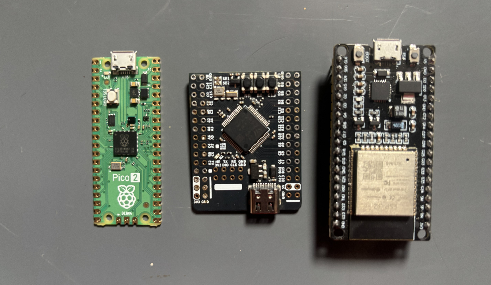

# Quick Start

Welcome to the JanFlight DIY Flight controller guide. 

### Reading this Guide

This documentation is split into three main sections:

- **JanFlight**: Hardware guides for building your flight controller. Pick your microcontroller and follow that specific guide (you can skip the rest).
- **Examples**: Step-by-step build guides for various drone configurations and projects using the DIY controller.
- **Additional**: Supporting technical guides, mathematical breakdowns, and reference material.

#### Recommended Learning Paths

1. **For Beginners & Non-Coders**
- Step 1: Read the [Basics Guide](content/basics.md) first to master fundamentals.
- Step 2: Pick a [Default Board](#default-janflight-breakout-boards) under `JanFlight` section and grab those parts (this avoids configuration headaches).
- Step 3: Follow [quadcopter](content/quadcopter.md) guide from `Examples` section to build your first quad.
- Step 4: If you're curious to learn more, check out the supporting guides under the `Additional` section.

2. **For Developers & Experienced Tinkerers**
- Step 1: Grab the JanFlight component list for your preferred microcontroller.
- Step 2: Pick a project from `Examples` to build or make something unique.
- Step 3: Refer to `Additional` section to explore the low-level math, filters, and code logic.

### Default JanFlight Breakout Boards

| Board | Raspberry Pi Pico 2 | ESP32 DevKitC | STM32F405RGT6 |
|-------------|-----------------|-----------------|-----------------|
| **Board Size** | 51 * 21 mm | 55 * 28 mm | 42 * 33 mm |
| **Board Weight** | 3.0 g | 6.9 g | 12 g |
| **Board Pins** | 40 pins | 38 pins | 45 pins |
| **PWM** | 24 | 16 (8 LEDC timers each with 2 output pins) | 14 |
| **Available UART** | 8 (2 + 6*PIO) +USB Serial debug | 3 | 4 USART, 2 UART |
| **Available SPI** | 2 | 2 | 3 |
| **Available I2C** | 2 | 2 | 3 |
| **MCU** | RP2350 | ESP32 | STM32F405 |
| **Processor** | 2 core M33 150MHz (overclock 300MHz) | 2 core LX6 240MHz | ARM Cortex-M4 168MHz |
| **FPU** | 2 core FPU | 1 core FPU | 1 core FPU |
| **RAM** | 520K | 320K data, 132K instruction, 64K cache | 192K SRAM |
| **Flash** | 4M QuadSPI | 2-16M QuadSPI | 1024K Flash |
| **Link** | [Guide](content/rp2350-hardware-setup.md) | [Guide](content/esp32-hardware-setup.md) | [Guide](content/stm32-hardware-setup.md) |

Pre-configured code for these default boards is available, while other boards from the same family may require modifications.

### Showcase

I’d love to see what you build! Feel free to share photos or videos of your builds with me on [Instagram](https://www.instagram.com/dikshit_makwana/). I regularly post my own projects, tutorials, and theoretical breakdowns there if you want to follow along.

If you’ve built a unique project that isn't covered here yet and want it featured in the documentation, feel free to submit a Pull Request on [GitHub](https://github.com/oyegunmen/JanFlight)!

### Parts

The flight controller build guide or example build includes direct purchase links of parts.

These are affiliate links; purchasing through them earns me a small commission at no extra cost to you. I personally buy my components from [FlyRobo](https://www.flyrobo.in/) and have been really happy with their quality of parts and service.

You're free to buy your parts from wherever you prefer, but using these links is a great way to support this project and help me create more projects. I appreciate any and all support. Cheers!

!> Yes, I know F450 frames, SimonK ESCs and some other parts belong in a drone museum. Fair enough. But, this guide isn't for building an industrial enterprise rig; it’s for tinkerers learning core flight mechanics. I listed these parts because every local electronics shop is still flooded with them.

*Last Updated: 7th Aug 2026*