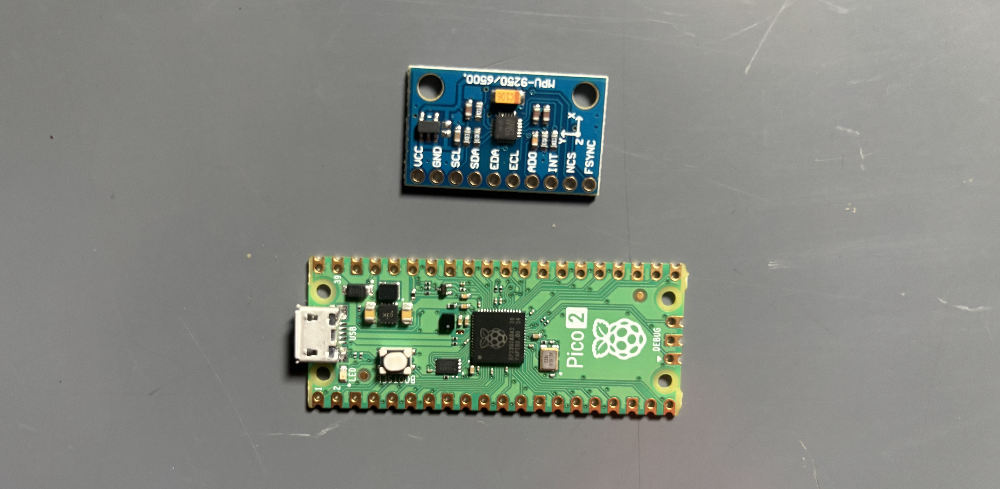
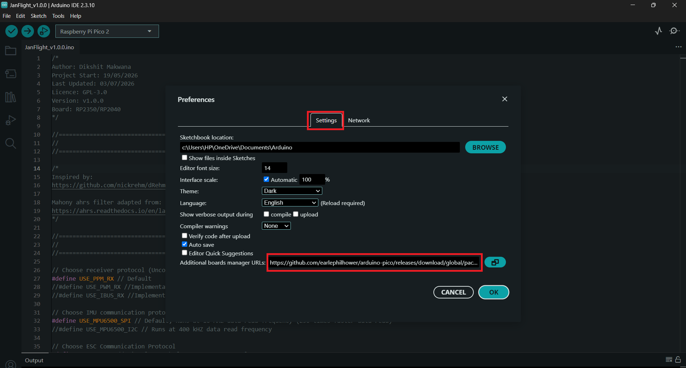
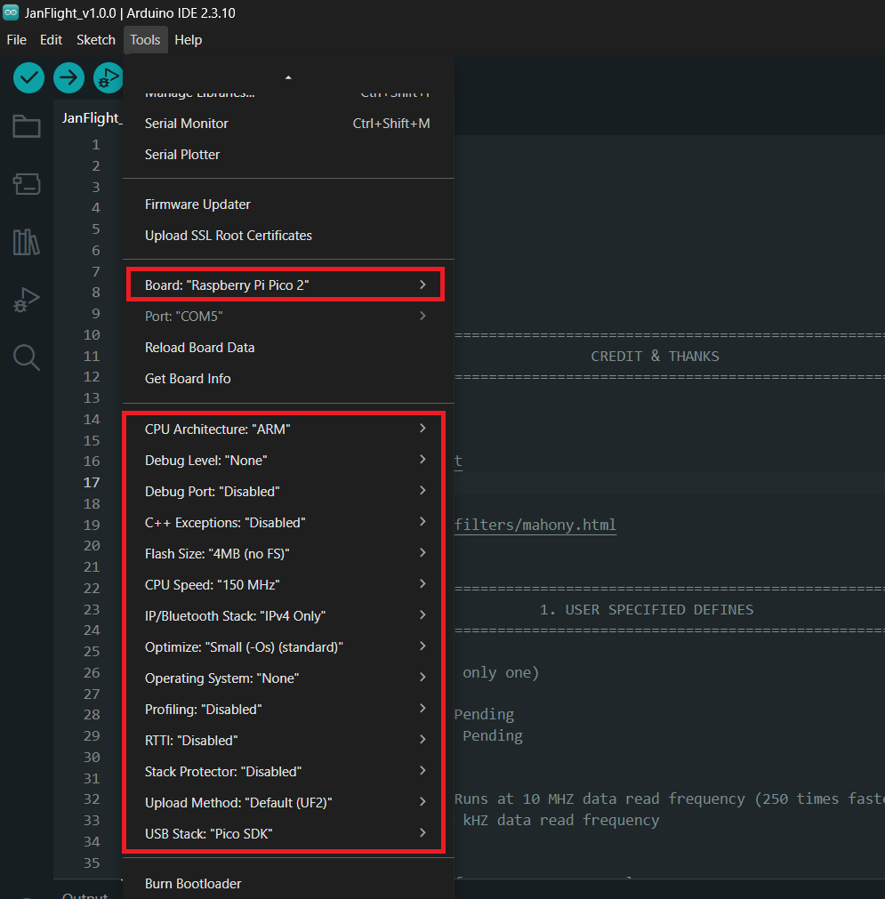
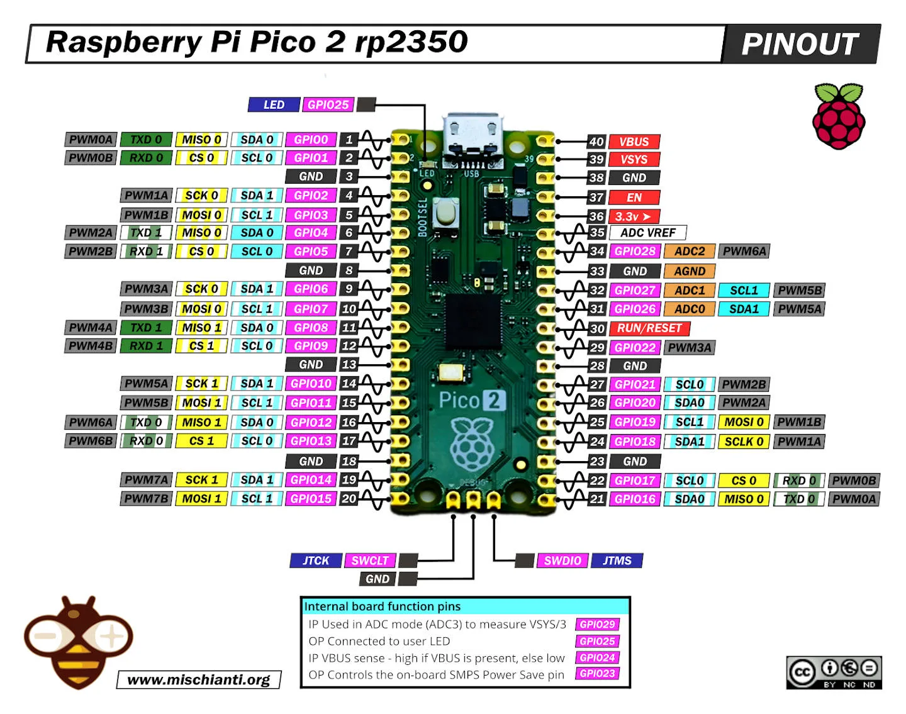

# RP2350 (Raspberry Pi Pico 2)

1. Get the required hardware
2. Development Environment
3. Configure the Control Mixer
4. Calibrate
5. Compile & Upload
6. FLY!

## 1. Get the required hardware
* Raspberry Pi Pico 2 (RP2350)
* MPU6500 IMU module



and other drone related parts.

See this [guide](rp2350-hardware-setup.md) to build your flight controller hardware.

## 2. Development Environment
Download the latest version of the [Arduino IDE](https://www.arduino.cc/en/software/) for your operating system.

Open your Arduino IDE and follow these steps to add RP2350 support:

1. Open Arduino IDE, go to **File > Preferences**. Under the Settings tab, locate the **Additional boards manager URLs** field and paste this exact link:

```Arduino
https://github.com/earlephilhower/arduino-pico/releases/download/global/package_rp2040_index.json
```



2. Open **Tools > Board > Boards Manager**. In the search bar, type **rp2040**. Locate **Raspberry Pi Pico/RP2040/RP2350** by Earle F. Philhower, III and click **Install**.

3. Go to **Tools > Board > Raspberry Pi RP2040/RP2350 Boards** and select **Raspberry Pi Pico 2**.

4. Go to **Tools > Port** and select the port your board enumerates.



## 3. Configuration
Download STM32 based firmware from [GitHub](https://github.com/oyegunmen/JanFlight/blob/main/src/RP2350/JanFlight_v1.0.0/JanFlight_v1.0.0.ino)

(a) **Update the Pin Declaration**: Refer to your specific board's datasheet and pinout diagram to determine the correct pins for your needs. Navigate to the section 4 of the code and change the pin assignments to match your respective board.



(b) **Adjust the Control Mixer**: Locate the `controlMixer()` function. This is where your radio control inputs map to the motor pins you just defined. Leave the default for a standard QuadX drone, or change the plus and minus signs inside this function to match your custom motor layout and rotation setup.

## 4. Calibrate

Connect your board via USB, select your port, and click Upload. Once complete, keep the IMU perfectly flat and uncomment `calculate_IMU_error()` in `setup()`.

Open the Serial Monitor to read your calibration offsets, data will be printed in the bottom output panel, write those numbers into the error variables at the section 3 of your code, and then comment `calculate_IMU_error()` back out.

!> Ensure the initial IMU offset errors in Section 3 are set to zero to allow for accurate calibration.

## 5. Compile & Upload

Reconnect your board via USB and Upload the code once more with calibrated IMU offset data.

!> You may need to tune the PID parameters in Section 3 to achieve optimal flight stability. If the drone feels sluggish or unresponsive, adjust these values to suit your specific build.

## 6. FLY!
Disconnect from your computer, double-check your failsafe and throttle cut switches with propellers off, verify the orientation, mount your gears, and head out for a test flight.

*Last Updated: 20th July 2026*
