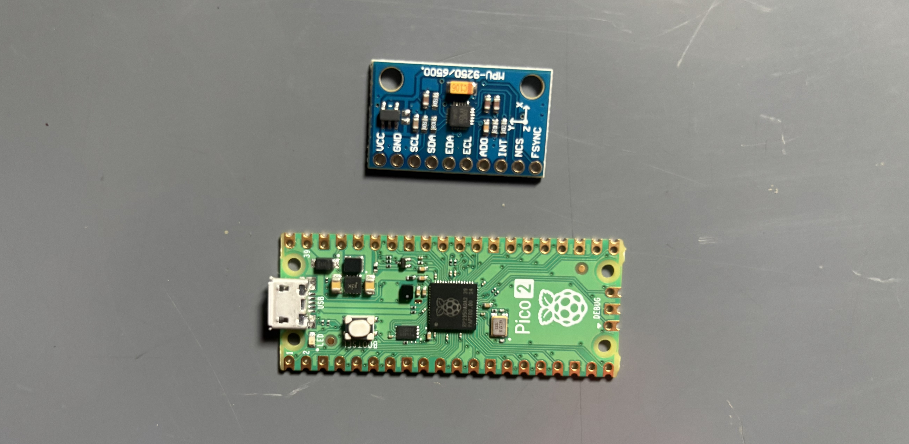
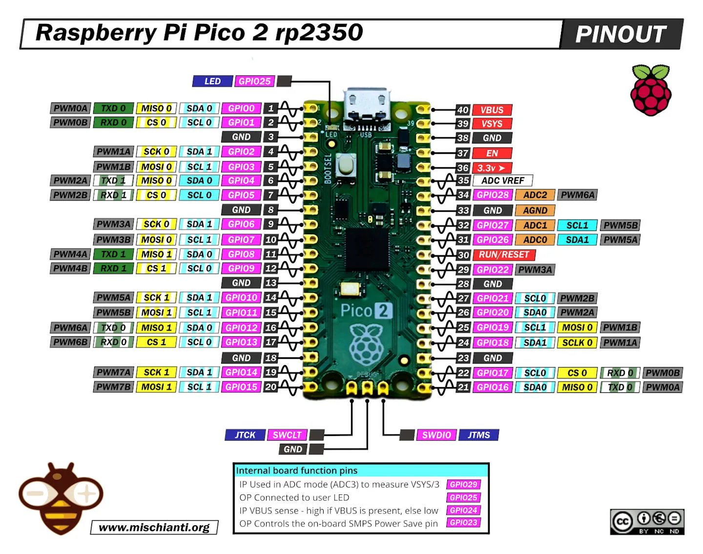
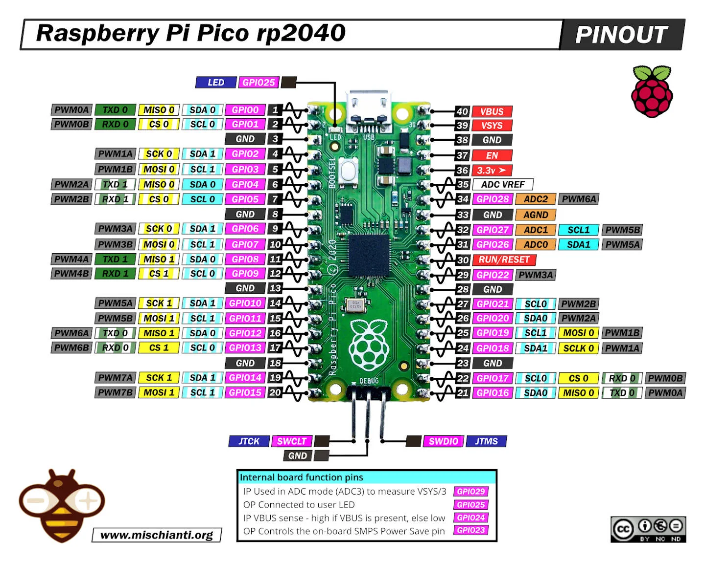

# RP2040 / RP2350 Hardware Setup

This guide covers building a custom flight controller using a Raspberry Pi Pico 2 (RP2350).

This example uses the [Raspberry Pi Pico 2](https://www.raspberrypi.com/documentation/microcontrollers/pico-series.html#pico2). The same guide can be used for Raspberry Pi Pico (RP2040).

## Parts List

<table>
  <thead>
    <tr>
      <th>Part</th>
      <th>Specs</th>
      <th>Price* (₹)</th>
      <th>Purchase</th>
    </tr>
  </thead>
  <tbody>
    <tr>
      <td rowspan="3">RP2040</td>
      <td>(Recommended)</td>
      <td>299</td>
      <td><a href="https://www.flyrobo.in/rp2040-16mb-raspberry-pi-pico-compatible-board-type-c?tracking=RlWmZUVohGHCRsAhWTrZyDfyKC3myArPWKC9tC7cAxOjEeW8PFqjN5SbOiOkNscf" target="_blank">Buy</a></td>
    </tr>
    <tr>
      <td>-</td>
      <td>366</td>
      <td><a href="https://www.flyrobo.in/raspberry-pi-pico-new-model-original?tracking=RlWmZUVohGHCRsAhWTrZyDfyKC3myArPWKC9tC7cAxOjEeW8PFqjN5SbOiOkNscf" target="_blank">Buy</a></td>
    </tr>
    <tr>
      <td>-</td>
      <td>279</td>
      <td><a href="https://www.flyrobo.in/ultimate-pico-rp2040-128mbit-16mb-microcontroller-development-board?tracking=RlWmZUVohGHCRsAhWTrZyDfyKC3myArPWKC9tC7cAxOjEeW8PFqjN5SbOiOkNscf" target="_blank">Buy</a></td>
    </tr>
    <tr>
      <td>MPU6500</td>
      <td>-</td>
      <td>237</td>
      <td><a href="https://www.flyrobo.in/mpu6500-gy-6500-6dof-6-axis-accelerometer-gyro-sensor?tracking=RlWmZUVohGHCRsAhWTrZyDfyKC3myArPWKC9tC7cAxOjEeW8PFqjN5SbOiOkNscf" target="_blank">Buy</a></td>
    </tr>
    <tr>
      <td rowspan="12">Miscellaneous</td>
      <td>Soldering Iron</td>
      <td>265</td>
      <td><a href="https://www.flyrobo.in/solder-iron-25w-yellow?tracking=RlWmZUVohGHCRsAhWTrZyDfyKC3myArPWKC9tC7cAxOjEeW8PFqjN5SbOiOkNscf" target="_blank">Buy</a></td>
    </tr>
    <tr>
      <td>Soldering Wire</td>
      <td>245</td>
      <td><a href="https://www.flyrobo.in/solder-wire-40-gsm-for-most-electrical-repair-soldering-purpose?tracking=RlWmZUVohGHCRsAhWTrZyDfyKC3myArPWKC9tC7cAxOjEeW8PFqjN5SbOiOkNscf" target="_blank">Buy</a></td>
    </tr>
    <tr>
      <td>Soldering Flux</td>
      <td>21</td>
      <td><a href="https://www.flyrobo.in/noel-yellow-soldering-flux-paste-10gm?tracking=RlWmZUVohGHCRsAhWTrZyDfyKC3myArPWKC9tC7cAxOjEeW8PFqjN5SbOiOkNscf" target="_blank">Buy</a></td>
    </tr>
    <tr>
      <td>Single Side Perf Board</td>
      <td>31</td>
      <td><a href="https://www.flyrobo.in/12_x_18cm_pcb_prototyping_printed_circuit?tracking=RlWmZUVohGHCRsAhWTrZyDfyKC3myArPWKC9tC7cAxOjEeW8PFqjN5SbOiOkNscf" target="_blank">Buy</a></td>
    </tr>
    <tr>
      <td>Double Side Perf Board</td>
      <td>43</td>
      <td><a href="https://www.flyrobo.in/5-x-7-cm-double-side-universal-pcb-prototype-board?tracking=RlWmZUVohGHCRsAhWTrZyDfyKC3myArPWKC9tC7cAxOjEeW8PFqjN5SbOiOkNscf" target="_blank">Buy</a></td>
    </tr>
    <tr>
      <td>Male To Male Jumper Wire</td>
      <td>53</td>
      <td><a href="https://www.flyrobo.in/10cm_male_to_male_jumper_cable_wire_for_arduino?tracking=RlWmZUVohGHCRsAhWTrZyDfyKC3myArPWKC9tC7cAxOjEeW8PFqjN5SbOiOkNscf" target="_blank">Buy</a></td>
    </tr>
    <tr>
      <td>Female To Female Jumper Wire</td>
      <td>53</td>
      <td><a href="https://www.flyrobo.in/40pcs_10cm_female_to_female_jumper_cable_wire_for_arduino?tracking=RlWmZUVohGHCRsAhWTrZyDfyKC3myArPWKC9tC7cAxOjEeW8PFqjN5SbOiOkNscf" target="_blank">Buy</a></td>
    </tr>
    <tr>
      <td>Male To Female Jumper Wire</td>
      <td>53</td>
      <td><a href="https://www.flyrobo.in/10cm_male_to_female_jumper_cable_wire_for_arduino?tracking=RlWmZUVohGHCRsAhWTrZyDfyKC3myArPWKC9tC7cAxOjEeW8PFqjN5SbOiOkNscf" target="_blank">Buy</a></td>
    </tr>
    <tr>
      <td>Wire Cutter</td>
      <td>60</td>
      <td><a href="https://www.flyrobo.in/wire-stripper-and-cutter?tracking=RlWmZUVohGHCRsAhWTrZyDfyKC3myArPWKC9tC7cAxOjEeW8PFqjN5SbOiOkNscf" target="_blank">Buy</a></td>
    </tr>
    <tr>
      <td>Male Double Row Header Pins</td>
      <td>7 x 5</td>
      <td><a href="https://www.flyrobo.in/2.54mm-double-row-straight-male-header-strip-2x40p?tracking=RlWmZUVohGHCRsAhWTrZyDfyKC3myArPWKC9tC7cAxOjEeW8PFqjN5SbOiOkNscf" target="_blank">Buy</a></td>
    </tr>
    <tr>
      <td>Male Single Row Header Pins</td>
      <td>8 x 5</td>
      <td><a href="https://www.flyrobo.in/40-pin-male-header-connector-strip-breakable-5pcs?tracking=RlWmZUVohGHCRsAhWTrZyDfyKC3myArPWKC9tC7cAxOjEeW8PFqjN5SbOiOkNscf" target="_blank">Buy</a></td>
    </tr>
    <tr>
      <td>Female Single Row Header Pins</td>
      <td>17 x 5</td>
      <td><a href="https://www.flyrobo.in/2mm-pitch-female-burg-strip-40-pin-5-pcs?tracking=RlWmZUVohGHCRsAhWTrZyDfyKC3myArPWKC9tC7cAxOjEeW8PFqjN5SbOiOkNscf" target="_blank">Buy</a></td>
    </tr>
  </tbody>
</table>

**prices as of 7th Aug 2026*

## Soldering

1. Get the required parts.

2. Solder header pins along both GPIO rows, matching the pin groups used in the wiring table below.

## Wiring

Connect components as outlined in the table below:

<table>
  <thead>
    <tr>
      <th>Component</th>
      <th>MCU Pin</th>
      <th>Part Pin</th>
      <th>Protocol</th>
    </tr>
  </thead>
  <tbody>
    <tr>
      <td rowspan="10"><strong>IMU</strong></td>
      <td>3.3 V</td>
      <td>VCC</td>
      <td rowspan="4">I2C</td>
    </tr>
    <tr>
      <td>GND</td>
      <td>GND</td>
    </tr>
    <tr>
      <td>GP5</td>
      <td>SCL</td>
    </tr>
    <tr>
      <td>GP4</td>
      <td>SDA</td>
    </tr>
    <tr>
      <td>3.3V</td>
      <td>VCC</td>
      <td rowspan="6">SPI</td>
    </tr>
    <tr>
      <td>GND</td>
      <td>GND</td>
    </tr>
    <tr>
      <td>GP18</td>
      <td>SCL</td>
    </tr>
    <tr>
      <td>GP19</td>
      <td>SDA</td>
    </tr>
    <tr>
      <td>GP16</td>
      <td>ADO</td>
    </tr>
    <tr>
      <td>GP1</td>
      <td>NCS</td>
    </tr>
    <tr>
      <td rowspan="4"><strong>Radio</strong></td>
      <td>GP2</td>
      <td>PPM/CH1</td>
      <td rowspan="4">PPM</td>
    </tr>
    <tr>
      <td>5 V</td>
      <td>Power</td>
    </tr>
    <tr>
      <td>GND</td>
      <td>GND</td>
    </tr>
    <tr>
      <td>-</td>
      <td>-</td>
    </tr>
    <tr>
      <td rowspan="4"><strong>ESC</strong></td>
      <td>GP6</td>
      <td>SIGNAL (ESC1)</td>
      <td rowspan="4">PWM/OneShot125</td>
    </tr>
    <tr>
      <td>GP7</td>
      <td>SIGNAL (ESC2)</td>
    </tr>
    <tr>
      <td>GP8</td>
      <td>SIGNAL (ESC3)</td>
    </tr>
    <tr>
      <td>GP9</td>
      <td>SIGNAL (ESC4)</td>
    </tr>
  </tbody>
</table>

!> **Warning**: Cut or remove the positive (red) power wire from all ESC signal connectors. Connecting them directly to the board will cause voltage back-feeding, potentially damaging your ESCs or the MCU.

## Firmware Flash & Verification

1. Connect the RP2340 to your laptop via USB and flash the [Janflight firmware](https://github.com/oyegunmen/JanFlight/blob/main/src/RP2350/JanFlight_v1.0.0/JanFlight_v1.0.0.ino).

2. Onboard LED Indicators (GP25 on a plain Pico 2):
    * Three quick blinks indicating the start of the setup.
    * Two quick blinks indicating the start of the main loop.
    * Consistent 1-second interval blinking confirming the loop is running.

3. Open the code in the Arduino IDE, scroll down to the main loop, and uncomment the following debug functions one by one, flashing the code each time to verify data in the Serial Monitor:
    * `printRadioData()`
    * `printRollPitchYaw()`
    * `printMotorCommands()`

If you are seeing data being printed in your serial monitor then your connections are fine.

Congratulations, your RP2350-based flight controller is ready for flying!

*Last Updated: 7th Aug 2026*
