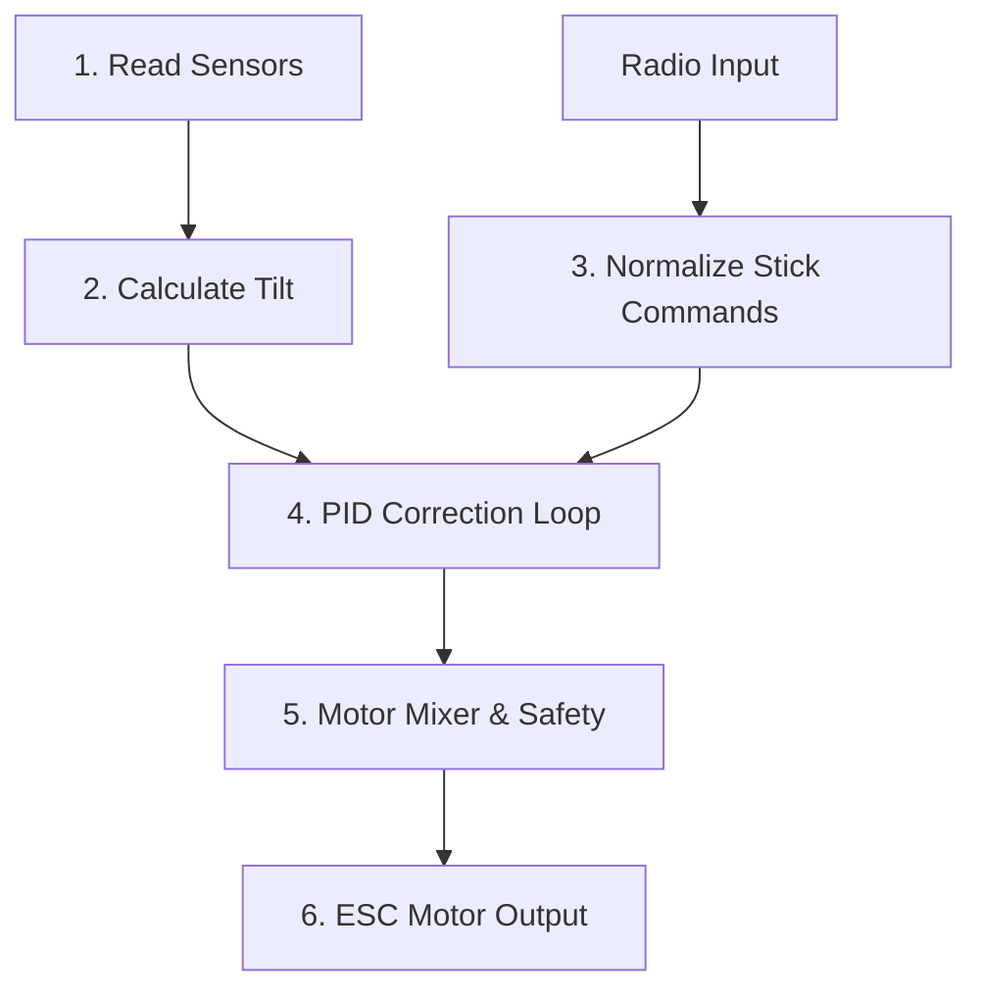

# Software

This firmware turns your **STM32F405** into a high-performance flight controller by organizing the code into a few simple blocks. Instead of using massive, complex background systems, it loops on a tight schedule to keep the vehicle stable.

Here is how the main system pieces interact to achieve stable flight:

## Core Principles

* **Setup & Loop:** Prepares the hardware on startup, runs a quick sensor warmup, and then runs the main flight functions on a strict,  schedule exactly 1,200 times per second (1.2kHz).

* **Sensor:** Board talks to the IMU sensor over I2C, handles custom baseline calibration adjustments, and filters out high-frequency motor vibrations so the drone doesn't get confused by minor shakes.

* **Orientation Tracking:** Uses a mathematical tracking filter ([Mahony](https://ahrs.readthedocs.io/en/latest/filters/mahony.html)) to merge raw motion data, establishing an accurate, real-time calculation of the drone's actual roll, pitch and yaw angles.

* **Radio Commands:** Listens to the radio receiver inputs in the background, smooths out raw signal noise, and safely maps your radio stick positions to exact target angles or rotation speeds requested by user.

* **Stabilization Engine (PID):** The brain of the flight controller. It continuously calculates the difference between where you want the drone to tilt and where it actually is, instantly computing precise adjustments to correct any error.

* **Actuator Output & Safety:** Takes the calculated correction adjustments, mixes them into individual power values for your specific frame layout, monitors the safety kill switch, and sends low-latency signals (via OneShot125 Protocol) directly to your motor speed controllers (ESCs).

*Last Updated: 5th June 2026*