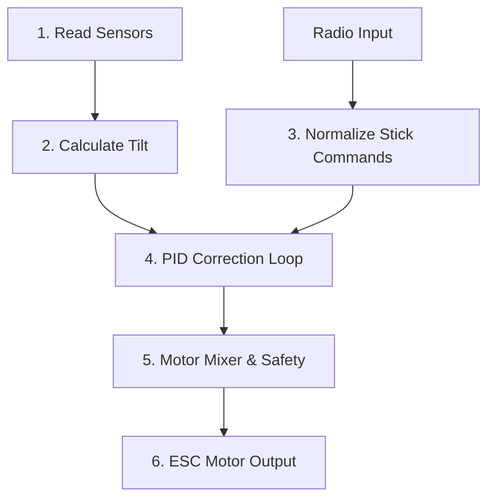

# Software

This firmware turns your **STM32F405** into a high-performance flight controller by organizing the code into a few simple blocks. Instead of using massive, complex background systems, it loops on a tight schedule to keep the vehicle stable.

Here is how the main system pieces interact to achieve stable flight:

## Core Principles

* **Setup & Loop:** Prepares the hardware on startup, runs a quick sensor warmup, and then runs the main flight functions on a strict,  schedule exactly 2,000 times per second (2kHz).

* **Sensor:** Board talks to the IMU sensor over I2C, handles custom baseline calibration adjustments, and filters out high-frequency motor vibrations so the drone doesn't get confused by minor shakes.

* **Orientation Tracking:** Uses a mathematical tracking filter ([Mahony](https://ahrs.readthedocs.io/en/latest/filters/mahony.html)) to merge raw motion data, establishing an accurate, real-time calculation of the drone's actual roll, pitch and yaw angles.

* **Radio Commands:** Listens to the radio receiver inputs in the background, smooths out raw signal noise, and safely maps your radio stick positions to exact target angles or rotation speeds requested by user.

* **Stabilization Engine (PID):** The brain of the flight controller. It continuously calculates the difference between where you want the drone to tilt and where it actually is, instantly computing precise adjustments to correct any error.

* **Actuator Output & Safety:** Takes the calculated correction adjustments, mixes them into individual power values for your specific frame layout, monitors the safety kill switch, and sends low-latency signals (via OneShot125 Protocol) directly to your motor speed controllers (ESCs).

## Code

Here is a high-level overview of how each function keeps the vehicle stable:

* `setup()`: Initializes the serial port, attaches the radio interrupts, configures the IMU registers, sets safe default variables, and warms up the orientation filter.

* `loop()`: The central coordinator. It calculates loop execution time (dt), fetches sensor readings, runs the orientation filter, processes radio commands, runs the PID math, updates actuators, and idles until the next loop boundary.

* `IMUinit()`: Wakes the MPU6500 from sleep and writes configuration bits directly to its registers to lock in the sensitivity ranges (250DPS for gyro, 2G for accelerometer).

* `getIMUdata()`: Requests a 14-byte chunk of raw data over I2C, scales it to physical values, applies your calibration offsets, and runs it through a basic low-pass filter to iron out motor vibrations.

* `calculate_IMU_error()`: Averages 5,000 stationary sensor readings to calculate the baseline manufacturing biases of your specific IMU chip.

* `Mahony()`: A 6DOF orientation filter that integrates gyro rates to track quick movements and balances them against the gravity vector from the accelerometer to eliminate long-term numerical drift.

* `calibrateAttitude()`: Forces the main loop to process 5,000 filter cycles on startup so the calculated pitch and roll angles stabilize completely before you take off.

* `getDesState()`: Normalizes raw radio microsecond pulses into exact degrees for angle mode or degrees-per-second for rate mode based on your set limits.

* `controlANGLE()`: The core PID loop. It measures the difference between where you want the drone to tilt and where it actually is, running independent Proportional, Integral, and Derivative calculations to correct the error.

* `controlMixer()`: Combines the independent axis forces from the PID loops with your base throttle command to output specific power levels for individual motors or servos.

* `scaleCommands()`: Takes the raw outputs from the mixer and constrains them into the strict microsecond boundaries required by your ESCs and servos.

* `throttleCut()`: A safety override that intercepts motor commands and forces them to a complete stop if your radio kill switch is flipped.

* `commandMotors()`: A custom, high-speed bit-banging routine. It manually flips the STM32 pins high, counts microsecond durations precisely, and pulls them low to generate low-latency OneShot125 signals for modern ESCs.

* `radioSetup()`: Maps the physical input pin to the background hardware interrupt routine.

* `getCommands()`: Low-pass filters the raw radio inputs to smooth out receiver signal jitter.

* `failSafe()`: Overwrites active controls with neutral and zero-power defaults if the receiver stops sending updates or glitches out.

* `loopRate()`: Monitors the system clock at the bottom of the loop, holding the processor in a microsecond-accurate loop until exactly 500 microseconds have elapsed, ensuring a stable 2kHz loop frequency.

* `getPPM()`: An asynchronous Interrupt Service Routine (ISR) that runs in the background, measuring the physical time between incoming radio pulses to decode your control stick channels.

*Last Updated: 22nd May 2026*