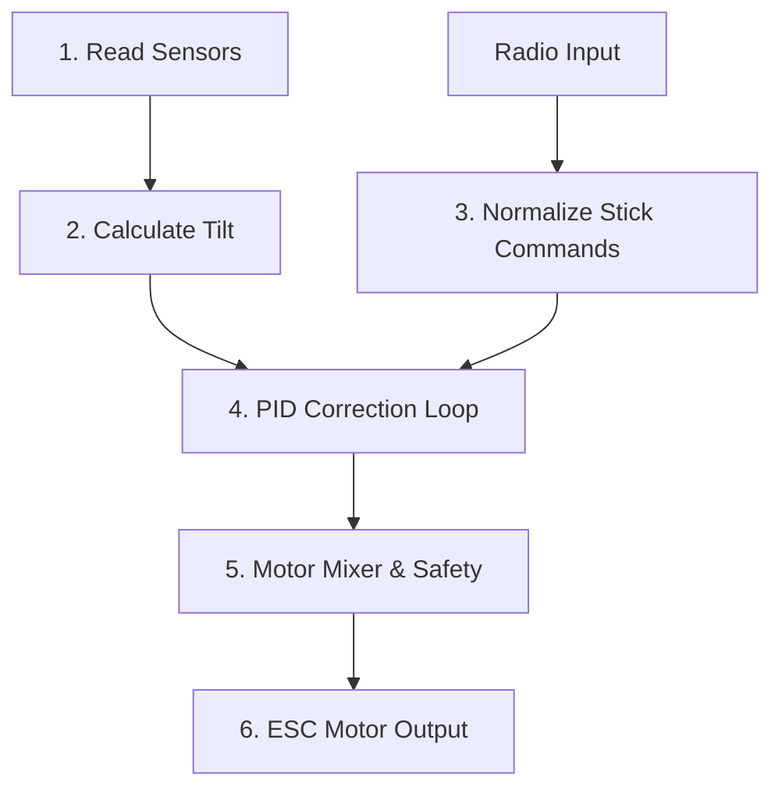

# Software

This firmware turns your **STM32**, **ESP32**, or **RP2350** into a high-performance flight controller by organizing the code into a few simple blocks.

Here is how the main system pieces interact to achieve stable flight:

## Core Principles

After the initial hardware setup, the main loop executes this entire 6-step pipeline on a strict, synchronized schedule exactly 1,200 times per second (1.2kHz)

#### 1. SENSE (Reads Sensors)

`getIMUdata()`

The MCU pulls raw Gyroscope and Accelerometer data over I2C/SPI. It immediately applies a low-pass filter to clean up the high-frequency electrical noise and mechanical vibrations caused by the spinning motors.

#### 2. ORIENT (Calculates Tilt)

`Mahony(...)`

The filtered motion data feeds into the mathematical Mahony AHRS Filter. This tracking engine fuses the data to establish an accurate, real-time calculation of the drone's actual tilt in 3D space (Roll, Pitch, Yaw).

#### 3. DESIRE (Listens to the Pilot)

`getCommands()` ➔ `failSafe()` ➔ `getDesState()`

Simultaneously, the firmware listens to your radio receiver. It smooths out signal noise, verifies failsafe conditions, and translates your physical stick positions into target angles (e.g., "The pilot wants to tilt 15 degrees forward").

#### 4. REACT (The PID Brain)

`controlANGLE()`

The Stabilization Engine compares Step 2 (where the drone is) with Step 3 (where you want it to be). The PID loop instantly computes the precise mathematical forces needed to correct any error between the two.

#### 5. MIX (Motor Mixer & Safety)

`controlMixer()` ➔ `scaleCommands()`

The abstract PID math is mapped to your physical drone geometry. The mixer calculates exactly which individual motors need to speed up or slow down for your specific frame layout (QuadX).

#### 6. ACT (ESC Motor Output)

`commandMotors()` ➔ `loopRate()`

The MCU translates the final mixer values into low-latency electrical pulses and fires them directly to your Electronic Speed Controllers (ESCs) via PWM or OneShot125 protocols.

*Last Updated: 5th June 2026*