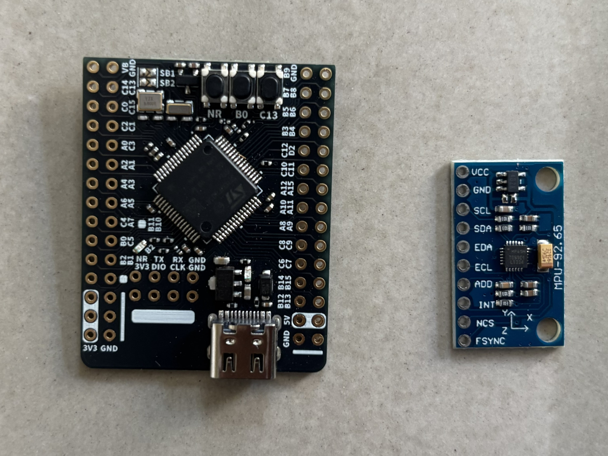
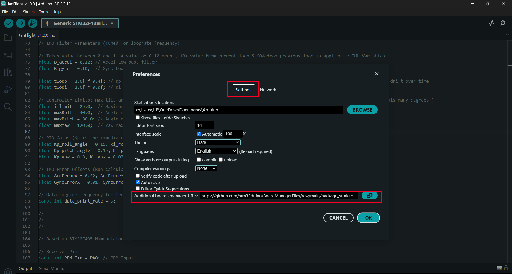
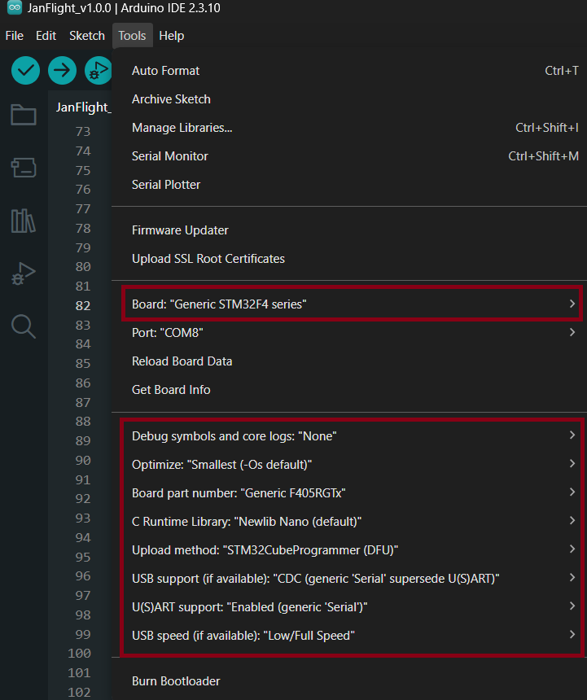

# STM32

1. Get the required hardware
2. Setup Arduino IDE development environment
3. Configuration
4. Calibrate
5. Compile & Upload
6. FLY!

An ordered list of STM32 microcontrollers found in commercial flight controllers, arranged from least to most powerful:

| MCU | Clock | Flash | RAM |
| :--- | :--- | :--- | :--- |
| **F411** | 100MHz | 512K | 128K |
| **F412** | 100MHz | 512K | 256K |
| **F446** | 180MHz | 512K | 128K |
| **G473** | 170MHz | 512K | 128K |
| **G474** | 170MHz | 512K | 128K |
| **F722** | 216MHz | 512K | 256K |
| **F745** | 216MHz | 1M | 256K |
| **F405** | 168MHz | 1M | 128K |
| **F427** | 180MHz | 2M | 256K |
| **H750** | 480MHz | 128K + 8M QSPI | 1M |
| **H723** | 550MHz | 1M + 8M OSPI | 564K |
| **H743** | 480MHz | 2M + 8M QSPI | 1M |
| **H753** | 480MHz | 2M | 1M |

## 1. Get the required hardware
* STM32F405RGT6 Breakout board
* MPU6500 IMU module



and other compatible drone related components.

See this [guide](stm32-hardware-setup.md) to build your flight controller hardware.

## 2. Development Environment
Download the latest version of the [Arduino IDE](https://www.arduino.cc/en/software/) for your operating system.

Open your Arduino IDE and follow these steps to add STM32 support:

1. Open Arduino IDE, Go to **File > Preferences** Under the Settings tab, locate the **Additional boards manager URLs** field and paste this exact link:

```Arduino
https://github.com/stm32duino/BoardManagerFiles/raw/main/package_stmicroelectronics_index.json
```



2. Open **Tools > Board > Boards Manager**. In the search bar, type **STM32**. Locate STM32 MCU based boards by **STMicroelectronics** and click **Install**.

3. Go to **Tools > Board > STM32 Boards (STM32Duino)** and select **Generic STM32F4** series.

4. Go to **Tools > Board part number** and select **Generic F405RGTx**.

5. Go to **Tools > U(S)ART support** and change the setting to **Enabled (generic 'Serial')**. This activates USB CDC support so you can stream raw telemetry directly through your USB cable.



!> **Info**: Your laptop might need the [Virtual COM Port driver](https://www.st.com/en/development-tools/stsw-stm32102.html) installed if it doesn't automatically detect the board when flashing via DFU.

## 3. Configuration
Download STM32 based firmware from [GitHub](https://github.com/oyegunmen/JanFlight/blob/main/src/STM32/JanFlight_v1.0.0/JanFlight_v1.0.0.ino).

(a) **Update the Pin Declaration:** Refer to your specific STM32 board's datasheet and pinout diagram to determine the correct pins for your needs. Navigate to the section 4 of the code and change the pin assignments to match your respective board.

b) **Adjust the Control Mixer:** Locate the `controlMixer()` function. This is where your radio control inputs map to the motor pins you just defined. Leave the default for a standard QuadX drone, or simply change the plus and minus signs inside this function to match your custom motor layout and rotation setup.

## 4. Calibrate
Connect your board via USB, select your COM port, and click Upload. Once complete, keep the IMU perfectly flat and uncomment `calculate_IMU_error()` in `setup()`.

Open the Serial Monitor to read your calibration offsets, data will be printed in bottom output panel, copy those numbers into the error variables at the top of your file, and then comment `calculate_IMU_error()` the function back out.

!> Ensure the initial IMU offset errors in Section 3 are set to zero to allow for accurate calibration.

## 5. Compile & Upload
Reconnect your board via USB and Upload the code once more with calibrated IMU offset data.

!> You may need to tune the PID parameters in Section 3 to achieve optimal flight stability. If the drone feels sluggish or unresponsive, adjust these values to suit your specific build.

## 6. FLY!
Disconnect from your computer, double-check your failsafe and throttle cut switches with propellers off, verify the orientation, mount your gears, and head out for a test flight.

*Last Updated: 13th July 2026*