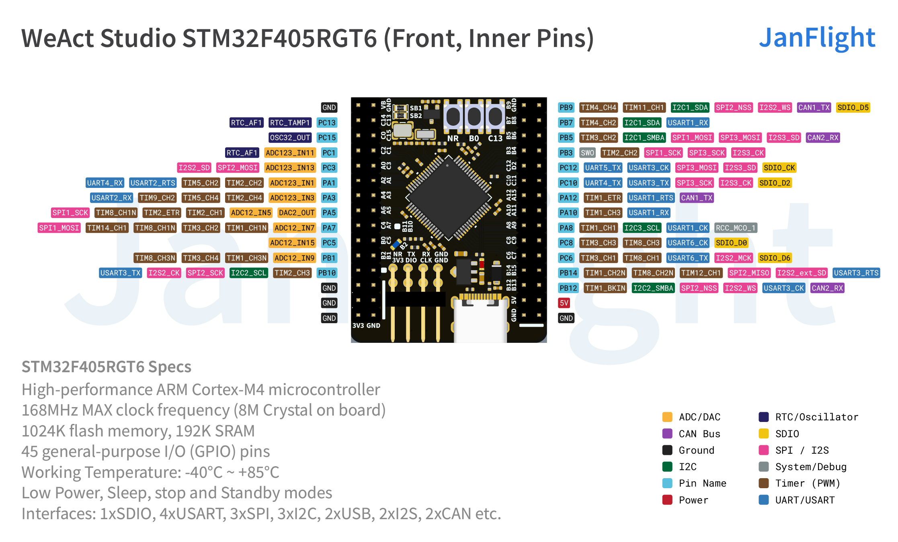
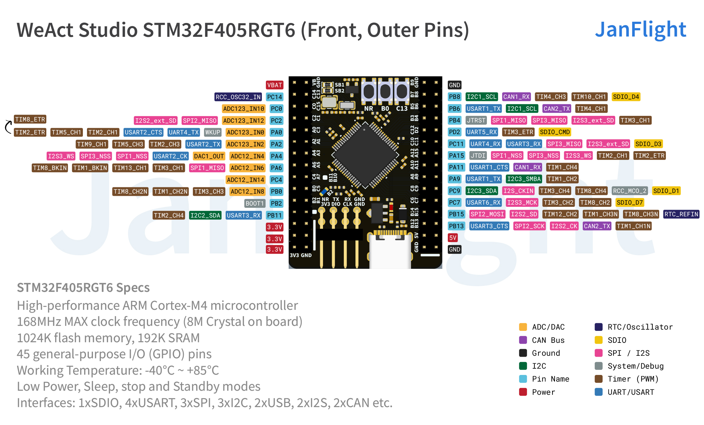
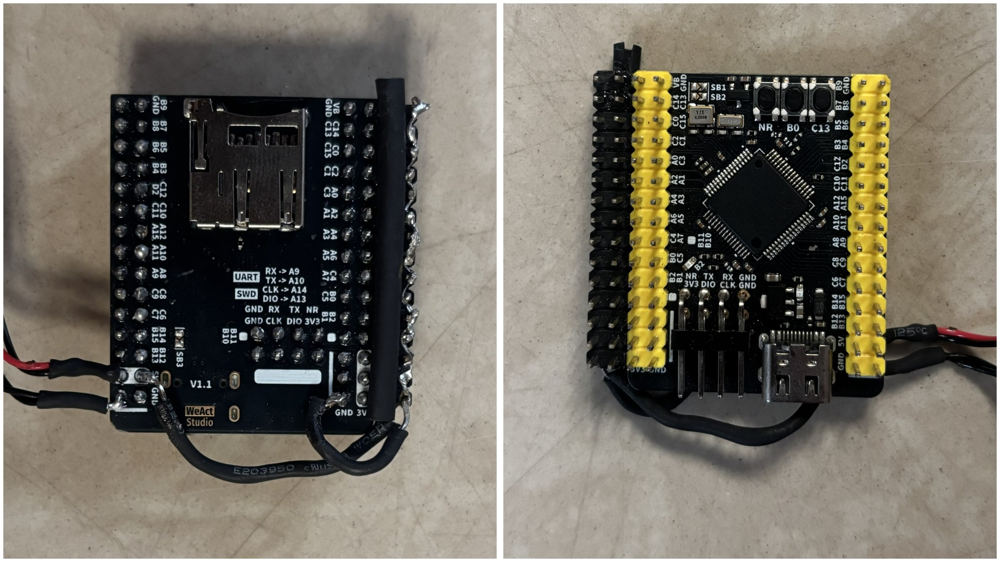

# STM32 Hardware Setup

This guide covers building a custom flight controller using STM32 breakout board.

This example utilizes the [WeAct Studio STM32F405RGT6](https://github.com/WeActStudio/WeActStudio.STM32F4_64Pin_CoreBoard).

## Required Components

* STM32F405RGT6 Breakout Board
* MPU6500 IMU
* FlySky FS-iA6B Receiver (or any PPM-output receiver)
* Header pins
* Soldering iron, flux, soldering wire, jumper wires, and cutting plier

## Soldering

1. Get the required parts.

2. Solder header pins to the board.

> Attach black header pins to provide a shared 5V/GND rail for ESCs as shown in the picture.

Solder a dedicated 5V/GND power supply from your Power Distribution Board (PDB) to the respective 5V/GND header pins to prevent voltage sags.

!> Ensure heat shrink tubes are used to avoid short circuit while keeping wiring clean.

## Wiring

Connect components as outlined in the table below:

<table>
  <thead>
    <tr>
      <th>Component</th>
      <th>MCU Pin</th>
      <th>Part Pin</th>
      <th>Protocol</th>
    </tr>
  </thead>
  <tbody>
    <tr>
      <td rowspan="10"><strong>IMU</strong></td>
      <td>3.3 V</td>
      <td>VCC</td>
      <td rowspan="4">I2C</td>
    </tr>
    <tr>
      <td>GND</td>
      <td>GND</td>
    </tr>
    <tr>
      <td>PB6</td>
      <td>SCL</td>
    </tr>
    <tr>
      <td>PB7</td>
      <td>SDA</td>
    </tr>
    <tr>
      <td>3.3V</td>
      <td>VCC</td>
      <td rowspan="6">SPI</td>
    </tr>
    <tr>
      <td>GND</td>
      <td>GND</td>
    </tr>
    <tr>
      <td>PB13</td>
      <td>SCL</td>
    </tr>
    <tr>
      <td>PB15</td>
      <td>SDA</td>
    </tr>
    <tr>
      <td>PB14</td>
      <td>ADO</td>
    </tr>
    <tr>
      <td>PB12</td>
      <td>NCS</td>
    </tr>
    <tr>
      <td rowspan="4"><strong>Radio</strong></td>
      <td>PA8</td>
      <td>PPM/CH1</td>
      <td rowspan="4">PPM</td>
    </tr>
    <tr>
      <td>5 V</td>
      <td>Power</td>
    </tr>
    <tr>
      <td>GND</td>
      <td>GND</td>
    </tr>
    <tr>
      <td>-</td>
      <td>-</td>
    </tr>
    <tr>
      <td rowspan="4"><strong>ESC</strong></td>
      <td>PA0</td>
      <td>SIGNAL (ESC1)</td>
      <td rowspan="4">PWM/OneShot125</td>
    </tr>
    <tr>
      <td>PA2</td>
      <td>SIGNAL (ESC2)</td>
    </tr>
    <tr>
      <td>PA6</td>
      <td>SIGNAL (ESC3)</td>
    </tr>
    <tr>
      <td>PB0</td>
      <td>SIGNAL (ESC4)</td>
    </tr>
  </tbody>
</table>

!> **Warning**: Cut or remove the positive (red) power wire from all ESC signal connectors. Connecting them directly to the board will cause voltage back-feeding, potentially damaging your ESCs or the MCU.

## Firmware Flash & Verification

1. Connect the STM32 to your laptop via USB and flash the [Janflight firmware](https://github.com/oyegunmen/JanFlight/blob/main/src/STM32/JanFlight_v1.0.0/JanFlight_v1.0.0.ino).

2. Blue LED Indicators:
    * Three quick blinks indicating the start of the setup.
    * Two quick blinks indicating the start of the main loop.
    * Consistent 1-second interval blinking confirming the loop is running.

3. Open the code in the Arduino IDE, scroll down to the main loop, and uncomment the following debug functions one by one, flashing the code each time to verify data in the Serial Monitor:
    * `printRadioData()`
    * `printRollPitchYaw()`
    * `printMotorCommands()`

If you are seeing data being printed in your serial monitor then your connections are fine. 

Congratulations, your custom flight controller is ready for flying!

*Last Updated: 13th July 2026*